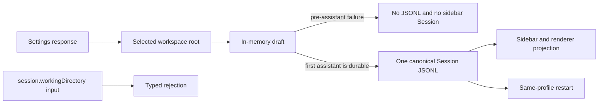

# OPT-010 Architecture-v2 Acceptance Evidence

## Identity and decision

- Acceptance gate: `architecture-v2`
- Optimization: `OPT-010`
- Review date: 2026-07-24
- Reviewed implementation checkpoint: `84b160a53706ef77efba02ca3bd55bef7a4ed396`
- Accepted code revision: `29699ce24006a34c676f47a3524e402019f2a3c8`
- Primary reviewer and implementer: root integration agent; no external self-acceptance was used
- Result: accepted

The accepted invariant is that the selected workspace root is the only path
authority for a Mortise Session. A workspace draft remains unpublished until
the first assistant-backed canonical Session is durable. The removed
`session.workingDirectory` field is rejected at typed ingress and is absent
from persistence, settings projection, runtime mutation, fixtures, and UI.

## Routed ownership

The primary routed the final files independently. Every file has one declared
owner:

| Owner | Reviewed responsibility |
|---|---|
| `session-lifecycle` | Session create rejection, persistence, projection, draft publication, restart behavior |
| `app-settings-security` | Workspace settings response without a Session-level path field |
| `native-desktop` | Current Electron branch fixture and native process lifecycle |
| `ui-validation-developer-kit` | Physical publication workflow, semantic settlement boundary, artifact integrity and cleanup |
| `build-release-observability` | Active ledger, completed archive, task-packet cleanup, and this durable manifest |
| `module-agent-system` | Reviewed module records and strict scope digests |

## Requirement-to-change map

| Requirement | Canonical final implementation | Direct evidence |
|---|---|---|
| One path authority | `SessionManager` receives the workspace root and has no persisted or mutable Session working directory | Session lifecycle regression and production source scan |
| Explicit legacy rejection | Session creation throws `RemovedSessionFieldError('workingDirectory')` when the removed input is present | `session-working-directory-contract.test.ts` |
| No settings alias | The settings DTO omits `workingDirectory` and exposes workspace state through the workspace contract | `settings-workspace-contract.test.ts` |
| Current native fixture | Branch rollback uses `workspaceRootPath` and no stale Session field | Isolated branch suite, 4/4 |
| Draft-only first turn | Failures before assistant output and during publication durability leave no new JSONL or sidebar Session | Isolated physical publication workflow |
| Durable publication | A successful retry publishes exactly one assistant-backed canonical JSONL and one sidebar Session | Physical workflow plus same-profile restart |
| Existing-Session rejection | The test waits for the persistent rejection semantic and exact redacted composer fingerprint before asserting no canonical write | Final `session-publication.ts` workflow |
| Evidence integrity | Concurrent evidence writers retain every manifest entry without Windows lock-release contention | Mortise UI regression, including the multi-process artifact test |

## Architecture comparison record

This convergence followed the previously frozen full-migration decision. The
bounded candidates were:

1. Keep the workspace root as the only authority and reject the removed field.
2. Preserve a Session-level field, alias, scrubber, mutator, or fallback.
3. Allow the renderer or fixture layer to choose a second working directory.

Hard constraints were one authority, no compatibility read/write path, typed
rejection, no unpublished Session artifacts, Pi-aligned first-assistant
publication, and restart-stable persistence. Candidates 2 and 3 violate those
constraints and were eliminated. Candidate 1 is the only admissible design.
Its deliberate cost is that retired callers fail explicitly instead of being
silently migrated.

## Reproducible evidence ledger

Local raw logs remain under ignored `output/` paths. This committed document is
the durable acceptance record; each locator is paired with a SHA-256 digest.

| Gate | Exact command or workflow | Result | Raw locator | SHA-256 |
|---|---|---|---|---|
| Focused contracts | `bun test packages/server-core/src/sessions/session-working-directory-contract.test.ts packages/server-core/src/handlers/rpc/settings-workspace-contract.test.ts apps/electron/src/renderer/components/app-shell/input/__tests__/composer-submission.test.ts` | 6/6 passed | `output/architecture-v2/opt010/focused-contracts.log` | `8adaf6de9fd00f93deafd612599828b50093643a4f1fc1cb55ca8e0adf5a3298` |
| Native branch fixture | `bun test ./apps/electron/src/main/__tests__/session-branch-rollback.isolated.ts` | 4/4 passed | `output/architecture-v2/opt010/branch-rollback.log` | `004855066297b73225e0386afc490ffbb8d327e5d48e5fc288dc06ec6fbb541e` |
| Session owner | `bun run scripts/module-agents/cli.ts test --module session-lifecycle --level fast` | Passed; 8,600 ms owner regression | `output/architecture-v2/opt010/session-lifecycle-fast.log` | `c9071e64585607f57f5b5484b3b45dbfb1899c5ee24e1965a2d9e16e525f2940` |
| Settings owner | `bun run scripts/module-agents/cli.ts test --module app-settings-security --level contract` | Config/auth/credential regression and Electron typecheck passed | `output/architecture-v2/opt010/app-settings-contract.log` | `65d9cf499603bb314f7eb23825870ed2cd2cec5633a853dbfa496f4924b06f73` |
| Native owner | `bun run scripts/module-agents/cli.ts test --module native-desktop --level contract` | Electron main/transport regression and typecheck passed | `output/architecture-v2/opt010/native-desktop-contract.log` | `02cc582acdd06a55270022702f1130de59e0f779a66f1ea8624ae8b2e263dcd5` |
| Developer Kit owner | `bun run scripts/module-agents/cli.ts test --module ui-validation-developer-kit --level contract` | Mortise UI 79/79 and UI fast 273/273 passed | `output/architecture-v2/opt010/ui-validation-contract.log` | `0aab5cf31c8093873a61ccf0a0139dfd6882524a9ed3cf94e6d79b7f9a4bee5e` |
| Production entry compile | `bun run validate:production-node-bundles` | Preload, workspace server, and Electron main compiled through the production protocol entry in 11,193 ms | `output/architecture-v2/opt010/production-node-bundles.log` | `d1318c7ce6720f974e4281cf5e5eef2f3e14c4247102b640ecd6d039ca35e4c1` |
| Strict ownership | `bun run scripts/module-agents/cli.ts validate --strict` | Valid; 24 modules, 2,998 managed files, zero diagnostics | `output/architecture-v2/opt010/module-strict.log` | `eb2c8a0a5fbae29d529933fc2479dab0cc9b131c6a4e7eb632f034d24a0b61b2` |
| Physical publication | `bun run test:ui-validation:session-publication` | Passed in 118.3 seconds across six stopped runs and twelve evidence bundles | Run identities below | Run and artifact hashes below |
| Final cleanup | Re-read all manual and automated run manifests, profiles, and recorded host/launcher PIDs | Eight runs stopped; zero profiles remain; zero recorded PIDs live | `output/architecture-v2/opt010/cleanup-receipt.json` | `944447a8b6dae305cc2da8ad0291e5fa254ebadec42f8e500531456b79f4f668` |

The production scan covered `packages/server-core`, `packages/shared`, and
`apps/electron`, excluding generated output and documentation. It found no
`updateWorkingDirectory`, `session.workingDirectory`, settings projection
alias, optional Session field, or native fixture field. Remaining
`workingDirectory` spellings in `packages/shared/src/prompts/system.ts` are
ordinary workspace-root function parameters, not Session state or compatibility
readers.

## Electron physical evidence

### Selected-workspace authority workflow

- Surface: source-development Electron, isolated fixture profile, background mode
- Initial run: `20260723-220930-d6c0c667`
- Same-profile recovery run: `20260723-223026-959f2b36`
- Immutable build ID: `de7fdddd94d3d0ad57fd7cb208634ffdf81ff866780b9d498b92bae713b9763a`
- Initial run manifest: `03518e7ad505fc5e756d1ce9d4fa783b275881f173c39e24b3bf7e51607ce3f1`
- Initial artifact manifest: `f4b4afeeb1a7d62aa3aa27b31ae77b928d4751d7019aff45ba2fc1db9fede53e8`
- Recovery run manifest: `f08d85ead32f321130a8bc4ac99711f641105c6de4bf2c8225573d717bcb7a75`
- Recovery artifact manifest: `304e43a9907662305edb4b056ee3ae3c750e206f1e05760a8045e4bde61c49fd`

The workflow entered the selected `authority` workspace through the normal UI,
imported `agent-prompt-writing` through the product skill flow, and verified
that the imported and source `SKILL.md` files had the same SHA-256:
`037db3661d9238185630b87471b5bbda057d34402d50b25b26129f95ce4c26b3`.
It mentioned both the imported skill and `authority.txt` from that workspace.

A deterministic first-turn failure left no canonical JSONL, sidebar Session,
or provisional sidecar. The successful retry created exactly one Session,
`260724-sunny-flow`. Its canonical header stored both `cwd` and
`mortise.workspaceRootPath` as the selected workspace root and contained no
`session.workingDirectory`. After restart, exactly one sidebar Session, the
skill/file mentions, and the assistant answer were restored. Final page errors
were empty.

### Publication and durability matrix

The final automated workflow used immutable build
`91af7ce6bd75668a07f82fc28c48eec77e0cb9936356f046f71236f02e9ac024`
and exercised pre-assistant failure, publication-metadata failure, successful
publication, ordinary Session user-write rejection with exact composer
restoration, identity-stable retry, settlement-only recovery, and same-profile
restart.

| Run | Run manifest SHA-256 | Artifact manifest SHA-256 |
|---|---|---|
| `20260723-231645-78d89ace` | `9fcd92f8ba4015c00241f28d7622d6605097d36ece631ab9be26a785cc152842` | `fc8265b8f833f396ec5b9cd679176511f4ccc617144b4236c0fde53c38da85cb` |
| `20260723-231706-77b2af27` | `351c71f04325f10366a25077419ac513ce02c4e893c49ccf67ba7ad26b32e002` | `f373b53aa2ba6fbf055bcf6f23a6225ac2b47a5eb12d17610caf477c89161907` |
| `20260723-231727-74dd122f` | `a4774663d7fbd6239cdeff96cca7bcfd43fd15c29071a2b48e17c1b951dc8f2a` | `84c3ca6f71eaff5e40f401d46dbedd8a7324db7ea6a407b73e3c001447f02ca4` |
| `20260723-231746-e1ecb023` | `e29e7f98b35082450e780957b20fafd95e1969a31d292eb3593dea8f07809cb1` | `f4e60d666dec02eead0b3df16354827d16c74e0995507712c845325f944e565b` |
| `20260723-231803-78a5ea7e` | `27c286a7a2fc01072182a4aef7653539a2f4be9966234fcc153d6ccedde44f34` | `58c89e5ea4e4aec4f487cfed44d9a704380653acc79018b414dc2708f06abb7d` |
| `20260723-231826-d5de98c9` | `de489afd8ed2e002c5b3771e872c9523ab884e341eb103d39615bd2790ae3faf` | `78767b37b425838f694502751b157cd60ced555947f679582f438dac1243f2f5` |

## Residual risk and acceptance reason

The manual run history includes rejected operator commands while discovering
the bounded validation action shape. Those receipts did not mutate production
state; the final scenario, semantic snapshots, persistence inspection, restart,
and cleanup all succeeded. Screenshots support composition only; state and
durability conclusions come from semantic, runtime, filesystem, and process
evidence.

The acceptance pass exposed and repaired a separate Windows evidence-lock race:
high-frequency live-owner probes could compete with lock-directory release.
Reaping probes are now rate-limited to 250 ms while dead-owner recovery remains
immediate on the first probe. Three simultaneous focused stress runs, the full
79-test CLI suite, and the 273-test cross-layer suite passed. This changes only
the source validation tool and does not add a product runtime compatibility
path.

OPT-010 is accepted because the workspace root is the sole current authority,
the removed Session field is explicitly rejected and absent everywhere else,
draft publication and existing-Session failure semantics are durable under
fault and restart, and all isolated profiles and processes were cleaned.
