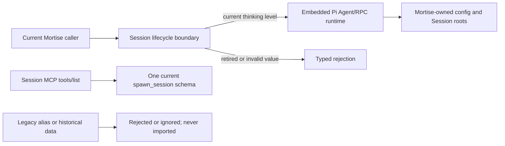

# OPT-016 Architecture-v2 Acceptance Evidence

## Identity and decision

- Acceptance gate: `architecture-v2`
- Optimization: `OPT-016`
- Review date: 2026-07-24
- Baseline revision: `5fb41ca6d8e6092f77e0403f3cc9a2fc5f4a02e4`
- Accepted code revision: `a640418eb2f1113cab104028f44556c2addcc6e0`
- Primary reviewer: root integration agent; no implementer self-acceptance was used
- Result: accepted

The accepted invariant is complete Mortise convergence: current runtime paths use
Mortise-owned roots and current contracts only; historical Sessions are not
imported; retired thinking levels and Session tool aliases are rejected rather
than normalized; user-owned data remains outside automatic cleanup.

## Routed ownership

`bun run scripts/module-agents/cli.ts impact --base 5fb41ca6d` routed every file
in the accepted change range to exactly one owner:

| Owner | Files in the accepted range |
|---|---|
| `build-release-observability` | `apps/electron/scripts/validate-assets.ts`; `docs/architecture/legacy-cleanup-inventory.md` |
| `session-lifecycle` | `packages/server-core/src/sessions/SessionManager.ts`; `packages/server-core/src/sessions/create-managed-session.test.ts` |
| `session-tooling` | `packages/session-mcp-server/src/tools-list-thinking-level.test.ts` |
| `pi-coding-runtime` | `pi/packages/coding-agent/test/bash-close-hang-windows.test.ts` |
| `module-agent-system` | The four changed `.agents/modules/*.md` owner records |

The durable evidence directory and the three optimization ledger files are owned
by `build-release-observability`. The module impact result recommended contract
validation for all affected owners.

## Requirement-to-change map

| Requirement | Canonical implementation | Direct evidence |
|---|---|---|
| Reject retired Session thinking values | `resolveSessionThinkingLevel` and `createManagedSession` throw `InvalidSessionThinkingLevelError`; explicit `think`, `max`, and invalid values do not fall back | Session lifecycle contract suite |
| Publish one current `spawn_session` schema | `SpawnSessionSchema` and real stdio MCP `tools/list` expose exactly `off|minimal|low|medium|high|xhigh` | Session tooling contract suite, including the stdio integration test |
| Remove legacy Session tool presentation | `resolveToolDisplayMeta` recognizes direct current tools and `mortise-docs`; `mcp__session__*` is not adapted | Positive direct-name and negative legacy-name tests |
| Remove Pi-named Mortise smoke storage | Electron asset validation uses `.mortise-agent-smoke` and supplies that path through the embedded runtime environment | Electron asset validation and isolated Electron profile inspection |
| Keep deterministic Windows cleanup | Detached-child teardown waits for the exact process identity to exit before removing its test directory | Pi coding runtime contract suite |
| Close the inventory without deleting user data | Every runtime compatibility row in `legacy-cleanup-inventory.md` is complete; external user-owned paths remain confirmation-gated | Inventory review and clean-profile runtime evidence |

## Architecture comparison record

This closing change was mechanical under the already frozen full-migration
decision. The bounded candidate set was:

1. Reject removed values and names at the owning contract boundary.
2. Preserve aliases, normalize old inputs, or add a compatibility reader.

Hard constraints were one authority, zero runtime fallback/alias/dual path,
current-version typed errors, no automatic user-data deletion, and unchanged Pi
Agent Loop semantics. Candidate 2 violates the first three constraints and was
eliminated. Candidate 1 was selected. Its deliberate cost is that old callers
fail explicitly and must move to the current contract; that is the requested
full-migration behavior.

## Reproducible evidence ledger

All local raw evidence is ignored build/test output. The committed manifest is
the durable acceptance record; the locators and hashes below permit independent
integrity checks but are not treated as durable merely because they exist under
`output/`.

| Gate | Exact command or workflow | Result | Raw locator | SHA-256 |
|---|---|---|---|---|
| Full monorepo | `bun run validate:monorepo` | Exit 0; Pi build/check/test plus canonical CI; UI fast 273/273 | `output/architecture-v2/opt016-validate-monorepo.log` | `e5b4722018ea7ca287b98ecfa151fe30a30ad3c19c37d49b3314971e22320485` |
| Canonical CI | `bun run validate:ci` | Exit 0; strict modules, module tests, dev/build/production bundles, UI fast, i18n gates | `output/architecture-v2/opt016-validate-ci.log` | `f0d329cba2bb1b5d9b257dce812d6da43f94d7e41ccaaaa9790a760d6ffcaa0c` |
| Session lifecycle | `bun run scripts/module-agents/cli.ts test --module session-lifecycle --level contract` | Passed; regression validation 8,286 ms | `output/architecture-v2/opt016/session-lifecycle-contract.log` | `695c5523dbad831805656ea32dd6371e4c782842b9d0dab69ac7b76608d1a4f8` |
| Session tooling | `bun run scripts/module-agents/cli.ts test --module session-tooling --level contract` | 60/60 plus cross-consumer typecheck; real stdio `tools/list` passed | `output/architecture-v2/opt016/session-tooling-contract.log` | `85e5d49120193870ddc2961ef4d70e10c5adeef4b7799fff26e2200ffc5b8e68` |
| Pi runtime | `bun run scripts/module-agents/cli.ts test --module pi-coding-runtime --level contract` | Coding regression and workspace contract passed | `output/architecture-v2/opt016/pi-coding-runtime-contract.log` | `93c4c93c8926e0ef2e5a3480d919fe068d49bd92d12b677b4b3994a80f7fb029` |
| Strict ownership | `bun run scripts/module-agents/cli.ts validate --strict` | Valid; 24 modules, 2,997 managed files, zero diagnostics | `output/architecture-v2/opt016/module-strict.log` | `5426f879fdc6085d1f74218f4ee9d21384d8a56ed0acf99b4ae55ea33585a2c4` |
| Staged Electron assets | `bun --cwd apps/electron run build:validate` | Compiled binary version/RPC smoke and staged assets passed | `output/architecture-v2/opt016/electron-assets.log` | `efe551a3e2bedefcdbb6d42b3b27e594fb08d4436226695bb1714556ec3fc634` |
| Production scan | Exact production roots under `apps`, `packages`, `scripts`, and embedded coding runtime; tests/docs/generated output excluded only where the denylisted spelling itself was the fixture | No active legacy Session tool adapter; retired thinking values occur only in explicit rejection material; Mortise `.pi` path reads/writes are absent; every Mortise `PI_CODING_AGENT_DIR` assignment resolves to the Mortise agent directory | Reproducible source scan at accepted revision | Not file-backed |

No performance candidate was introduced by this contract cleanup. The only
runtime change is fail-fast validation before Session creation, so a distribution
benchmark would not test the accepted invariant; full runtime and production
bundle gates were used instead.

## Electron physical evidence

- Surface: source-development Electron, isolated profile, background mode
- Run ID: `20260723-212145-4e8419b0`
- Immutable build ID: `a31b999cedb531b02227517fc372db48b8e486e6573eb2dcbef1b65a45acb70c`
- Evidence bundle: `output/mortise-ui/20260723-212145-4e8419b0/artifacts/2026-07-23T21-26-53.311Z-03766212`
- Bundle manifest SHA-256: `45c434b982282e4d2b32a19a407d032f6b28395f8fe364bc6b69e6c16b1e90a`
- Final run manifest SHA-256: `0e7bed4fba7a94487a61e9a68a222e90482475f75791d4c3403237c6fc89a59d`

The evidence manifest reports `native-verified`. After the development-only
onboarding skip settled, the application reached `allSessions/new/default` with
app, transport, workspace, route, and Session state ready. Session count was
zero and the workspace-scoped draft composer was present. The isolated profile
contained only Mortise config and Electron user-data roots; it contained no
`.pi` directory or file. Page errors were empty. The evidence bundle contains
semantic full/incremental snapshots, UI state, screenshot, console, events,
network summary, main-process identity, and runtime log, each with its own hash
inside the bundle manifest.

The independent user `~/.pi` tree was observed unchanged before and after the
run at 54,514 files with metadata digest
`6b16d4604e9fa86d9c210b9c146a365a225c16d0b48b07529874040e6f557d93`.
The isolated profile was removed on stop and all six recorded run processes were
confirmed exited.

## Residual risk and acceptance reason

The onboarding click receipt settled before its asynchronous route transition;
the later capability and evidence snapshots prove the final route. That action
settlement behavior is a Developer Kit lifecycle concern, not an OPT-016
compatibility path. Historical stopped-run liveness display also remains a
separate Developer Kit/build-lifecycle audit item. Neither issue reads or writes
legacy data, creates `.pi`, accepts retired thinking values, or restores an alias.

OPT-016 is accepted because all inventory rows have one current authority,
retired inputs are explicitly rejected, zero compatibility readers/writers or
aliases remain in production, the complete automated gate is green, and an
isolated immutable Electron build proved clean Mortise-only startup without
touching independent Pi state.
