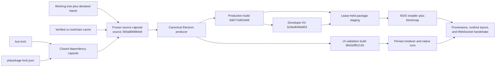

# OPT-017 Canonical Immutable Build Producer

Acceptance gate: `architecture-v2`

Base revision: `2a7416b3edefba4f2df18272dddb1fb6fc4f23f1`

Routed owners: `build-release-observability` owns the canonical producer and
packaging boundary; `ui-validation-developer-kit` owns build consumption,
run-to-host identity, renderer/native action semantics, and retained evidence.
`native-desktop`, `extension-ui`, and `shared-contracts` own the affected
consumer contracts. The primary agent owns cross-module integration and final
acceptance.

## 结论

- Recommendation: `reuse-first` within the repository's established immutable
  build architecture.
- Selected design: promote the existing source capture, file-lock,
  atomic-write, and Electron build-cache primitives into one build-owned
  producer, then make production validation, target packaging, Developer Kit,
  and `mortise-ui` consume its verified manifest.
- Reason: external task caches are mature, but none is a complete replacement
  for frozen dirty-worktree capture, atomic artifact inventory, per-run pinning,
  tamper rejection, sealed runtime layout, and installer provenance. Adding one
  beside the existing producer would create two authorities.

## 冻结研究范围

The candidate search was frozen before implementation around root build
scripts, `scripts/build-source-snapshot.ts`, the former UI-owned build cache,
Developer Kit caching, Electron resource staging, production bundle validation,
Electron Builder hooks, and three mature task-cache alternatives. The search
stopped after evaluating one candidate from each materially different
integration breadth.

| Candidate | Score | Gate | Evidence | Material disadvantage |
|---|---:|---|---|---|
| Turborepo | 94 | pass | L2 | Restores declared task outputs but does not freeze the live Git worktree or own Mortise runtime leases and installer provenance. |
| Nx | 94 | pass | L2 | Introduces a broader workspace authority while still requiring Mortise-specific publication and runtime validation. |
| Lage | 80 | pass | L3 | Its output-glob cache cannot prove the production binary chain, and its dependency invalidation guarantees are weaker. |

The deterministic scorer input remains in
`docs/architecture/optimization-evidence/opt-017-reuse-candidates.json`.
Maturity was not the acceptance gate: all three candidates fail the task-specific
constraint that one producer own source identity, artifact bytes, runtime pins,
and packaging provenance.

Frozen hard constraints:

- one source identity and one build authority;
- no ignored or pre-existing binary input;
- build only inside the captured source;
- atomic content-addressed publication with complete SHA-256 inventory;
- same-identity single producer and different-identity parallel builds;
- active-run leases and bounded retention;
- production validation and packaging consume the same manifest;
- sealed runtime layout with no live-checkout, PATH, alias, or compatibility
  fallback.

Decision priorities after the hard constraints were canonical ownership and
dependency direction 30%, failure/concurrency semantics 20%, packaging
reproducibility 20%, testability/observability 15%, resource cost 10%, and
migration cost 5%. Ties prefer fewer authorities and dependencies.

## 最终架构

- `scripts/build/electron-build-cache.ts` is the sole source/build identity,
  publication, verification, lease, and retention authority. Production
  validation, packaging, Developer Kit staging, and `mortise-ui` consume the
  immutable manifest instead of fingerprinting or linking the live checkout.
- A source capsule installs closed root Bun and embedded Pi npm dependency
  domains. It builds Pi workspace output, the compiled Pi executable, Electron
  production entrypoints, renderer/resources, and the immutable runtime layout.
- Published manifests inventory artifacts with SHA-256 and are verified on
  cache hits and before staging. External uv is a build-root-owned,
  content-addressed toolchain cache protected by the same lock and atomic
  publication primitives.
- Runtime layout authority is host-neutral at
  `@mortise/session-tools-core/runtime`. Electron and headless hosts validate the
  sealed layout once, propagate it explicitly, strip inherited layout variables,
  and resolve every runtime/tool only from that layout.
- Platform packaging converges on `scripts/build/package-electron.ts`.
  Electron Builder consumes a lease-held staging copy, and `afterPack` verifies
  application and Developer Kit provenance, final runtime layout, and the
  packaged workspace-server WebSocket handshake.
- UI action authority follows the same ownership rule. Stable renderer selectors
  resolve against the surface driver's own live snapshot; explicit refs remain
  revision-bound and fail closed. Windows native actions inherit the selected
  window's HWND, verify its PID, and resolve descendant runtime IDs only in that
  window's UIA subtree instead of Desktop Root.
- Known transient Windows UIA RPC failures are retried only for readiness and
  idempotent window-state operations inside the original deadline. Permanent
  failures and non-idempotent clicks are never replayed.
- Raw-host physical input validates finite renderer geometry and sends one real
  CDP mouse action. It does not import Playwright locator actionability as a
  second readiness authority, force clicks, or invoke synthetic DOM events.
- Extension interaction sections, fields, options, inputs, and actions publish
  stable protocol-ID semantics. Scenario reset, status, clock, and evidence are
  owned by the active scenario source and remain idempotent across repeated reset.

The dependency direction is acyclic: UI validation consumes the producer;
packaging composes a verified production build and version-matched Developer
Kit; no consumer can publish a second identity or fall back to mutable output.

## 最终身份

- Source: `359a866884d4177b56a286ba66fb6e3bf880e881e86e1d7401a8133e33e7f887`
- Production build: `9dd77e991b08adcad4cc2b1f75ebdf853d4db0f8c64757c8ab1aeb997f96b8ed`
- UI-validation build: `9b91bff521297ae7a6464aeff490dd1fd74ca6ee4fbc175b93977b2f4094119a`
- Developer Kit: `b2ded646dd535aabfc0818473a9b11c8e7ad798ba6bd9d736e4842e8a38fec3b`
- Runtime contract run: `20260725-163651-f4890421`
- Native physical run: `20260725-165208-efa22276`
- Extension physical run: `20260725-165432-007c8f86`
- Raw-host run: `raw-1784998566496-01a977fd`

## 验收结果

| Gate | Result | Decision-relevant evidence |
|---|---|---|
| Focused renderer/native regressions | pass | Stable-selector and Windows native/readiness suites passed; typed retry and non-idempotent fail-closed cases are explicit. |
| `ui-validation-developer-kit full` | pass, 658.5 s | 74/74 CLI tests, cross-layer fast contract, runtime run `20260725-163651-f4890421`, reset revisions `[7,7]`. |
| `native-desktop full` | pass, 151.4 s | 521/521 isolated main/transport tests, Electron typecheck, renderer/native run `20260725-165208-efa22276`. |
| `extension-ui full` | pass, 46.3 s | 39/39 isolated contribution tests and scenario/renderer/native run `20260725-165432-007c8f86`. |
| `shared-contracts contract` | pass, 25.0 s | Shared protocol/util regressions and shared typecheck. |
| Module refresh and strict validation | pass | 24 modules, 3009 managed files, zero diagnostics. |
| `bun run typecheck:all` | pass, 115.3 s | All workspace TypeScript contracts compiled. |
| `bun run validate:production-node-bundles` | pass, 17.8 s | Workspace-server, Electron main, and preload compiled from the production protocol entry. |
| `bun run validate:production-bundles` | pass, 52.5 s warm | Production build `9dd77e991b08`; source `359a866884d4`; verified uv cache restore. |
| `bun run test:ui-validation:runtime-contract` | pass, 515.4 s cold | Run `20260725-163651-f4890421`; repeated reset revisions `[7,7]`. |
| `bun run test:ui-validation:raw-host-smoke` | pass, 27.7 s warm | Run `raw-1784998566496-01a977fd`; auth rejection, request identity, protocol revision, finite geometry, real CDP mouse input, and renderer advancement passed on pinned UI build `9b91bff52129`. |
| `bun run electron:dist:win` | pass, 1159.1 s cold | NSIS, blockmap, 725 packaged files, 818 Developer Kit files, app/DK provenance, 13-asset sealed runtime layout, one Bun copy, and packaged workspace-server handshake passed. |
| `build-release-observability full` | pass, 542.3 s | Pi build/check/test, production Node/bundle gates, strict module validation, complete CI composition, UI fast contract, and i18n parity passed. |

The local package is intentionally unsigned and has no publish provider, so the
generated blockmap is the expected update artifact and `latest.yml` is not part
of this gate. Release jobs must set `MORTISE_REQUIRE_CODE_SIGNING=1`.

## 原始证据

| Artifact | SHA-256 |
|---|---|
| `apps/electron/release/Mortise-x64.exe` | `e6eec5a806ac1e634da53d1e50412d1d01e598825451e05a41e10e1e40366200` |
| `apps/electron/release/Mortise-x64.exe.blockmap` | `c1fe2d0681d54ef61928faf83625fca08b8044f5f836b223a34c33df86489573` |
| production `build.json` | `537b98839f0e9f5693c7508ca6ac556b5b64e4ab7cf4b3fa72f50acdd21369df` |
| UI-validation `build.json` | `469b662dac5c00c652a5d7a2552f32d9afcac39a6aec011d4f54465cf274e660` |
| Developer Kit `build.json` | `408ddcd49779fdfd148358e4d65d1532ac0ca459b79ef8ba76117c671b210dd5` |
| raw host smoke result | `13cbc336f6838afe8f497ae96e44dd1156506e593ade2877e5228e3498b550f3` |
| runtime-contract `run.json` | `6b89830fe34da1964c64cedbb8eee3673f51e5a1976d8f5346a4dc4e07858158` |
| runtime-contract evidence manifest | `1d0c2745af2f8e5afa11246819c1c2bd32986eb696cf091b6f09b04868efe9bd` |
| native physical `run.json` | `459ed9fa6ff9a1ebe58e58c8a5ee3de420ad435ca9ca0904e5176f9d9517c266` |
| native physical evidence manifest | `410f7b0a130949bbe3d0111566eb34a97ed10adee912d2b1f73dfbdb011c067f` |
| native semantic snapshot | `783a8272a0130ebda50ad20d7084ebb5ee533b78425b9da537d0845e7956dccd` |
| native screenshot | `d521a272da480f65450bfb6e2fb07429d17e3b2f4cca267362d443828648f23b` |
| extension physical `run.json` | `414512fc0a56186fef29c8f9e121b3c067c5c6f06a57b87b69ddf48eb4f5d9c5` |
| extension physical evidence manifest | `1477067b5cf974a1761263a6d1942306b577bc4a845569c87e2d9b1cc6007f21` |
| extension semantic snapshot | `5d9b35ea962b4bd13e58e3cddb1a552e1115899d93f8b0303eeb0854088c6eda` |
| extension screenshot | `a5ff07ccd2d667d7345184d6b82b72e6c3536e621e7eba70aa7a325d22916da4` |

Raw ignored evidence remains under `output/electron-builds`,
`output/developer-kit-builds`, and the identified `output/mortise-ui` run
directories. This tracked record stores their immutable identities and hashes
without treating ignored output as the only acceptance record.

## 失败与恢复

- A physical extension action first crossed a snapshot/ref timing boundary.
  The fix moved stable selector resolution into the surface driver's one live
  snapshot instead of refreshing a ref in Test Host and passing it back later.
- Windows UIA first exposed transient RPC faults during Desktop Root
  enumeration. Retrying within the original deadline correctly failed when that
  authority stayed unavailable. The canonical fix uses PID-verified HWND focus
  and window-scoped descendant lookup; it does not widen timeouts or replay
  non-idempotent clicks.
- Raw-host smoke then reproduced two 30-second Playwright locator-click
  timeouts after the target was already visible. Background frame throttling
  made locator geometry stability a second, non-convergent readiness authority.
  The canonical fix validates one finite bounding box, sends real CDP mouse
  input at its center, and proves renderer advancement; it does not force the
  locator or call a DOM handler.
- A clean post-commit capture changed source identity even though declared build
  inputs were unchanged. The temporary index had been seeded from `HEAD`, so
  unrelated tracked paths outside the declared source set remained in its tree.
  The canonical producer now starts from an empty index and adds only declared
  inputs; a two-commit regression proves excluded tracked documentation neither
  changes identity nor enters the materialized capsule.
- One broad native module invocation returned a non-reproducible aggregate
  failure with truncated output. The exact isolated command immediately passed
  521/521, and a complete repeated `native-desktop full` then returned
  `passed:true` with 521/521, typecheck, and native physical verification. It is
  retained as transient harness evidence, not classified as a product defect.
- No live-checkout dependency link, PATH fallback, runtime alias, compatibility
  reader, or second build authority was restored. The 600-second cold-start
  budget remains unchanged.

## 风险与回滚

- Complete dependency preparation remains intentionally expensive. Future
  optimization must target the closed dependency capsule without weakening its
  closure or creating a second cache authority.
- Full artifact verification adds bounded cache-hit I/O; this is accepted because
  runtime and installer provenance require byte identity rather than path presence.
- Rollback trigger: one source identity publishes byte-distinct manifests, a
  tampered capsule is accepted, a consumer reads outside its pinned capsule, a
  native action escapes its selected window, or Developer Kit packaging performs
  an independent dependency/toolchain build.
- Rollback action: revert the canonical producer integration and reopen OPT-017;
  do not restore the UI-owned cache, per-platform packagers, live `dist`, Desktop
  Root action discovery, PATH lookup, or compatibility readers.

## 决策

Accepted. OPT-017 establishes one immutable source/build authority from clean
dependency installation through UI validation and Windows packaging, with the
same ownership rule applied to renderer and native action resolution. Final
module gates, production entrypoints, retained physical evidence, installer
provenance, and packaged workspace-server handshake all passed on the recorded
source identity.
