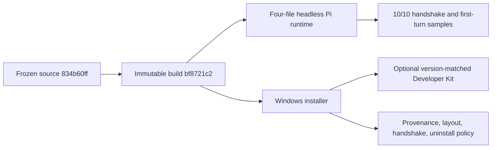

# R11 Architecture-v2 Acceptance Evidence

## Identity and result

- Gate: `architecture-v2`
- Accepted implementation revision: `7f905fa17eb5b49ae447fba4e53cf942719e7934`
- Commit range reviewed: `5a6cefc02..7f905fa17`
- Final build: `bf8721c228070b009dc25389e3be6804e41ea36cda6bff99df3cd5caf5b2b565`
- Final source: `834b60ff95427be9e0bc0076b0cf6242804577e5848f897aaaf18719610ba2a3`
- Producer: Bun `1.3.14`, executable SHA-256 `0187f68d843f825a72ada4a7eca60db896ed753759a7f8252edcd31ac1bf1b9c`
- Result: `OPT-011`, `OPT-014`, `OPT-015`, `OPT-017`, and `OPT-018` accepted

The primary independently reviewed the routed implementation and raw receipts. Product behavior is covered by source-development Electron, Developer Host, focused contracts, and the exact final headless executable. Installer evidence is limited to installer-owned responsibilities: immutable provenance, payload inventory, optional Developer Kit packaging, runtime layout, package-time workspace-server handshake, uninstall policy, and cleanup. No ordinary installed-app onboarding, model-backed message, UI acceptance, or installed-process Pi RPC handshake is claimed.

## Requirement map

| ID | Accepted invariant | Decisive evidence |
|---|---|---|
| `OPT-011` | One resolver and one compiled, manifest-bound Pi runtime; retired selectors, JS fallback, missing runtime, and provenance mismatch fail closed. | Resolver/afterPack focused tests `26/26`; final manifest/runtime inventory; retired selector probe. |
| `OPT-014` | Workspace manifests and graph validation are authoritative; `shared -> session-tools-core` is allowed and the reverse edge is rejected. | Split C1 receipts, production entry build, dependency/metafile and reverse-edge guards. |
| `OPT-015` | Automations V3 store/protocol is the only runtime/query authority with transactional indexed projections and cursor fencing. | Frozen indexed-query receipt, 8/8 operations, maximum warm/cold p95 `12.821/14.294 ms`; unchanged automation inputs after `f4b1ec1c2`. |
| `OPT-017` | One immutable source/build producer supplies packaging; Bun producer, bundled runtime, CI, manifest, and expected-build packaging identities are explicit. | Final Bun 1.3.14 build/package hashes; package consumed `--expected-build-id`; stale/collision probes and package provenance passed. |
| `OPT-018` | Only the UI-neutral headless Agent/RPC runtime is staged; no TUI, interactive, standalone CLI, updater, terminal asset, or JS runtime remains. | Four-file runtime inventory, zero legacy matches, and final 10/10 headless performance/handshake samples. |

## Evidence ledger

| Gate | Result | Raw locator | SHA-256 |
|---|---|---|---|
| C1 build/pin prefix | Passed identity-bound constituent gates | `E:\_workSpace\_Agents\craft-agent-acceptance-evidence\r11\r11-c1-build-pin-ba57f8e6.log` | `f5727d85483140f66a1e5f755af5cd60156415a7b0911e74b90af819d90bd030` |
| C1 suffix | Tests, 279 UI-validation checks, i18n, and remaining gates passed | `...\r11-c1-suffix-da9915a17.log` | `a5cc0040869911c43ba960a15ef2d3d9c4cd70ccd35dcc15c9c622c2cb7f43e7` |
| Final production build | Build `bf8721c2`, Bun 1.3.14 | `...\r11-c1-production-bun1314-7f905fa17.log` | `cf05494944bdd532e9b8bdf42303f5a3a90a9e74b2c64091ca7aa4c5d225514a` |
| Final build manifest | Immutable schema v5 manifest | `output/electron-builds/builds/bf8721c2.../build.json` | `967e888d3eaeaf708c8a6c3cb4f45f495c8f413137ae6fb496857f67b015d59d` |
| C2A | Complete, policy compliant | `output/architecture-v2/r11/opt015-index-performance-f4b1ec1c2.json` | `927e7fec9ababd6916a679124537d1e6f75d32641355c323a24f24754a8eae83` |
| C2B policy | Frozen v2 policy | [`opt-018-performance-policy-v2.json`](./opt-018-performance-policy-v2.json) | `bb54512655298b6e7d64097602d99efa68d59efa770cbbe1f88a32700cc7461e` |
| C2B first Bun 1.3.14 set | Retained invalid: handshake p95 +6.52% while machine was not idle | `...\opt018-headless-candidate-bf8721c2-bun1314.json` | `dd0d998e375fded7ec004768521970e76dfa76463552a7193556bd7a56444137` |
| C2B final idle set | Complete; 10/10, handshake median/p95 `432.047/462.008 ms`, settled median/p95 `157.497/162.818 ms`, all comparisons passed | `...\opt018-headless-candidate-bf8721c2-bun1314-idle-retry.json` | `d0c1ef072bf0a53486f84fb0947c3b57f30b0854dea6bc1e6dff35a6efae844a` |
| Focused resolver/installer tests | 26 passed, 0 failed | `...\r11-c3-focused-runtime-installer-tests.log` | `48106b9fe03988c4a549a6273910d00d19b5328e2c3252a434a8a3ca31ec67d2` |
| Final package | Provenance, 640-file Developer Kit, runtime layout, workspace-server handshake, NSIS output passed | `...\r11-c3-package-bun1314-bf8721c2.log` | `f8d757755f17c6d7ee9b71102af8c103bb222cd3ab168235da38b8df530f5302` |
| Installer | `Mortise-x64.exe`, unsigned local acceptance artifact | `apps/electron/release/Mortise-x64.exe` | `1bcaab6a7ff9d2b270104d80d35d7aa9db55438fd5327aeb0e9d5c7d2986e4dd` |
| C4 final validation | 22/22 focused tests; strict validation 24 modules / 2641 files / zero diagnostics; diff check passed | `...\r11-c4-final-validation.log` | `f8c2d1830803c472099324658e129b0776da1aa76bd9723389525a48ef04c78c` |

## Deviations and cleanup

The first isolated uninstall exposed `deleteAppDataOnUninstall: true`, which could remove user-owned default Electron state. Revision `c38f946f8` changed both application and Developer Host installers to preserve AppData and added a contract test. Revision `7f905fa17` aligned packaged and CI Bun producers on current stable `1.3.14`. The final package contains both corrected settings. The earlier isolated install was removed with exit code 0 and left zero owned processes; its broad AppData deletion is recorded as the defect that caused the correction, not as passing evidence. The user's `.mortise` product data and machine-wide `E:\Program Files\Mortise` installation were not deleted.

The final installer was not installed or driven through ordinary product UI. This is intentional: source/Developer Host evidence owns product behavior, while this package gate owns artifact and installer boundaries. Any divergence between those surfaces is a shared-boundary defect, not a reason to duplicate routine functional acceptance in the installed app.
