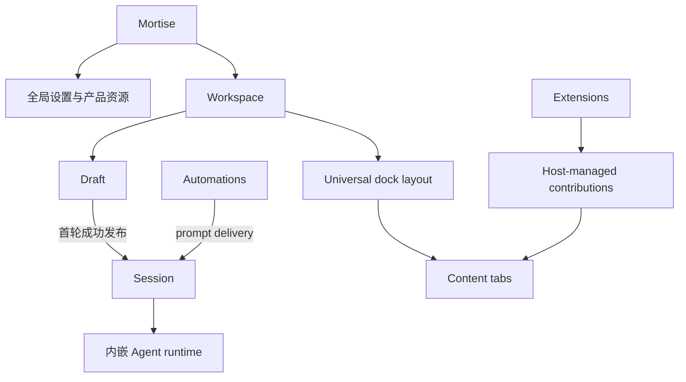
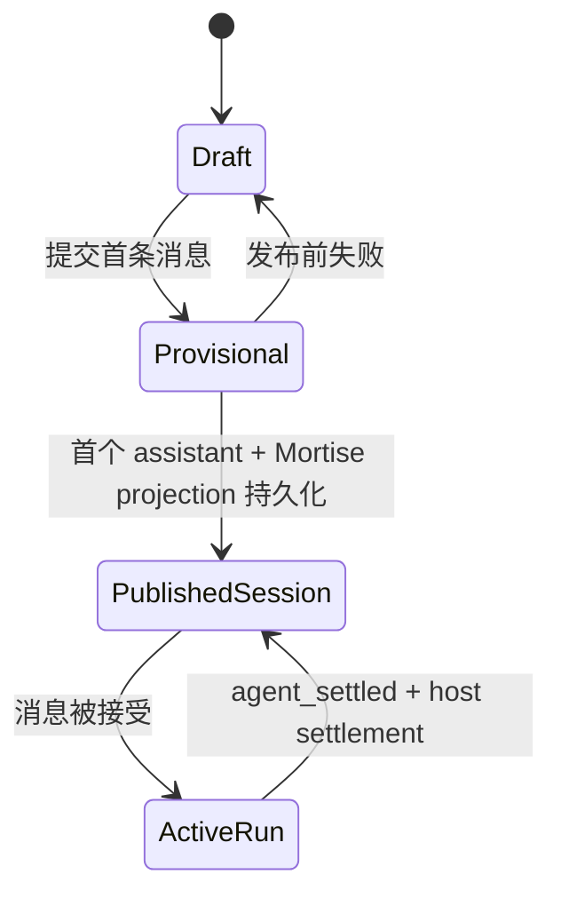

# Mortise 产品语义参考

状态：初始参考

更新日期：2026-07-28

## 用途

本文档集中记录 Mortise 目前已经可以确定的产品含义：核心概念是什么、它们如何关联、哪一层拥有解释权，以及哪些边界不应被实现偶然性改变。

它是产品与架构判断的参考，不是任务流程、开发检查表、API 手册或功能清单。使用它不需要为每次修改填写固定模板或报告。

本文档只把有明确依据的内容写入正文。文中明确标注为仍需决定的问题不是已接受语义，也不能用来推导实现。

## 参考边界

- 明确接受的产品决定和已接受的专题规范，是本文档的依据。
- 本文档说明产品含义；专题架构和协议文档说明对应领域的精确合同。两者应相互一致，而不是互相复制。
- 模块档案说明代码所有权、局部不变量和验证责任，不单独定义跨模块的产品含义。
- 现有代码、测试和历史行为是需要调查的上下文，不会因为已经存在就自动成为产品需求。
- 当本文档与已接受的专题规范真正矛盾时，这表明存在待解决的语义缺口；不应由旧代码默认选择其中一边。

## 产品定位与边界

Mortise 是一个由用户塑造、高度可扩展的桌面 Agent 平台。它优先通过用户配置和 Extension 扩展能力，而不是把所有工作流都固定在核心产品中。

- 产品名为 `Mortise`；无作用域的机器标识使用 `mortise`；项目自有包使用 `@mortise`。
- 本仓库只拥有 Mortise 产品和发布线。`pi/` 是 Mortise 自有的内嵌无头 Agent runtime 源码，不是本仓库中另一个独立产品、CLI 或发布线。
- 内嵌 Agent runtime 拥有 Agent Loop、Session 主会话记录、工具执行、compaction、retry 和 Extension runtime 等运行时语义。
- Mortise host 拥有 Workspace、客户端 UI、导航、通用布局、操作系统集成、Automations 编排和其他产品脚手架。
- Mortise 运行时和项目资源只使用 Mortise 自有的 `.mortise` 根。`.pi` 属于外部独立产品，不是 Mortise 的运行模式、fallback 或兼容数据源。

## 核心概念图

该图只表达产品概念关系，不表达代码依赖方向或存储结构。

## Workspace 与内容

### Workspace

Workspace 是 Mortise 的顶层用户上下文，也是内容和布局的长期归属边界。它不等同于文件夹，但始终有且只有一个主位置，并可以同时连接零个或多个附加位置；每个位置都指向一个本地或远程文件根。

- Workspace 允许用户设置自己的显示名称。用户没有设置名称时，默认使用当前主位置根目录的最后一级文件夹名；这是派生的默认名称，不是 Workspace identity。切换主位置后，未自定义的名称随新的主文件夹更新，用户自定义名称则保持不变。
- Session、Files 工作台、Browser 实例、侧任务、Extension 完整工具和 Dock 布局都带有 Workspace 归属。
- 主位置是 Agent 默认使用的工作位置，决定未明确指定位置时的命令行目录和相对路径起点。附加位置不会改变这个默认值。
- 本地主位置可以由用户主动选择。用户未选择时，Mortise 在默认 Workspace 目录下为它创建独立、持久的根目录；该目录不是临时目录或能力受限的 fallback，Agent 可以正常使用文件工具和命令行。远程主位置由对应的远程 Agent Server 提供。
- 附加位置不是只能查看的资料引用。在各自获得的权限范围内，Agent 可以像使用主位置一样读取、写入、搜索文件和运行命令；同一个 Workspace 可以同时包含本地与远程位置，并统一管理它们的访问权限。
- 每个位置都有稳定、可辨认的名称和明确的执行端点。搜索等操作可以覆盖多个已授权位置，但命令必须在目标位置所在的本机或远程端点执行；跨端点移动数据是明确的传输操作，不能伪装成同一文件系统内的普通路径操作。
- 每个已连接位置中都保存版本化的 Mortise Workspace 标记，其中包含稳定的 Workspace identity。创建 Workspace 或明确添加尚未标记的位置时，Mortise 写入该标记；之后重新连接时，只接受带有匹配标记的位置。
- 同一个 Workspace 标记可以同时存在于多个本地或远程位置中。标记只说明该位置已获准连接到这个 Workspace，不区分本体、复制品或唯一原件；哪个位置是主位置、哪些是附加位置，由 Workspace 当前的连接关系决定。
- 用户可以新增附加位置，而不必为每个文件根另建 Workspace，也不必因此中断已有任务。移除或替换位置前，Mortise 必须先中断仍可能继续使用该位置的 Session、子智能体、Automation run、工具或子进程，但不应无故中断与该位置无关的工作。
- 用户可以将带有匹配标记的位置切换为新的主位置。切换主位置时，Mortise 统一中断该 Workspace 中正在运行、排队、等待输入或等待恢复的 Session、子智能体和 Automation run，并停止仍可能写入旧主位置的工具或子进程；完成中断后再原子切换。
- 位置变更不会自动恢复被中断的任务。任务历史保留为 interrupted，之后可以由用户或 Agent 明确继续，并使用变更后的当前位置集合和主位置。未来尚未形成 run 的 Automation 调度定义不受影响。
- 一个已渲染布局不得混合不同 Workspace 的内容。
- 切换 Workspace 会替换整个活动布局，而不是只替换当前 Session 或左侧栏。
- 主侧栏以 Workspace 为中心，每个可展开 Workspace 下直接显示最近 Session；非 Workspace 导航保持在底部。
- 点击另一个 Workspace 下的 Session，语义上是切换 Workspace 并打开该 Session 的一次动作。

### Universal dock

每个 Workspace 拥有一套可保存的 universal dock 布局。

- Conversation、Files、Browser、侧任务和 Extension 完整工具都是平等的 content tab。
- 用户可以对 content tab 分组、拆分、移动和 detach；宿主拥有 tab 身份、标题、选择、关闭、焦点、权限和恢复语义。
- 每个 Electron 应用身份只运行一个客户端实例；再次启动同一应用时聚焦已有实例。该限制不作为跨客户端或共享数据的全局锁。
- 在一个 Electron 客户端实例中，同一 Workspace 只有一个主窗口和一套 canonical layout，但可以拥有多个可写的 detached 辅助窗口；再次打开该 Workspace 时聚焦已有主窗口，而不是创建另一份主窗口或布局。
- Detached tab 或 group 仍属于原 Workspace 的同一布局，只是由辅助原生窗口承载。
- WebUI 不提供 Mortise 管理的多窗口能力。打开带有 Electron detached 窗口状态的 Workspace 时，WebUI 只在当前页面中把这些内容投影为普通并列标签页；该投影不改写 Electron 保存的窗口归属、位置和尺寸，再次从 Electron 打开时仍恢复原有多窗口布局。
- WebUI 对内容本身的新增、关闭和移动可以更新共享的 logical dock 状态，但仅仅打开或查看 Workspace 不得把 Electron detached 窗口永久 redock。浏览器自身的窗口和标签页不属于 Mortise Workspace 布局。
- Electron、WebUI、不同版本的已安装客户端和源码开发客户端可以同时连接 Mortise。每个 Electron 应用身份各自遵守单实例规则，共享数据正确性仍由规范数据层的并发协议保证。
- `right` 只能是用户布局后的一个结果，不是产品 surface、Extension API 或专用右面板架构。应用 shell 不存在第二侧栏。
- 页面或 content surface 需要相邻导航时，使用该 surface 内部所有的 sidebar，不恢复全局右面板。
- 紧凑状态信息，例如 TODO、plan、后台任务或子会话摘要，默认使用轻量 popover 或悬浮状态，不自动成为持久 content tab。

### 内置内容差异

- Browser 新建 tab 是轻量空白页，不承载任务模板、Agent onboarding 或创建并发送 prompt 的操作。
- Browser 实例是 Workspace 的长期内容资源，不由某个 Session 拥有。同一 Workspace 中的 Session 可以创建、打开和控制 Browser 实例，并在自己的历史中记录使用关系；Session 关闭、归档或结束时不自动销毁 Browser。
- Session 的临时浏览需求复用同一种 Workspace Browser，不建立第二套 Session-scoped Browser 类型。临时实例可以在任务结束后由用户或发起它的任务关闭，但它在存在期间仍遵守 Workspace 的布局、权限和生命周期边界。
- Browser 实例的布局和生命周期归属于 Workspace，但 Mortise 浏览器档案属于应用全局。不同 Workspace 共享 Mortise 自有的登录状态、cookie、站点存储、history 和其他浏览器档案数据，不为每个 Workspace 建立隔离档案。
- 本地浏览器数据和 Chrome 浏览器扩展导入不属于当前已承诺能力。未来若提供浏览器扩展导入，只接受经过确定性兼容检查、确认其 manifest 和所用 API 均受当前 Electron Browser runtime 支持的扩展；不导入兼容性未知的扩展，不以 best-effort 加载或运行后碰运气作为支持方式，也不承诺 Chrome Web Store 或任意 Chrome/Edge 扩展兼容。
- Files 是 Workspace-scoped content workbench：选中文件在主区域显示，Workspace 文件树是该 tab 内部的 navigator，对不支持、过大或不安全的格式提供安全 fallback。
- 对有未保存编辑、正在运行或等待用户输入的 content，关闭或布局调整不应无提示丢失工作。

## Draft、Session 与 Agent 运行

### 主智能体、子智能体与模板

- 主智能体是当前 Session 中直接承接用户对话和主要任务的 Agent。它是 Session 的运行主体，不需要另外作为一个独立的、可单独管理的产品对象存在。
- 子智能体属于 Mortise 的核心能力，不再把它的长期产品边界理解为某个 Extension 私有能力。现有 Extension 形式的实现和设置文案属于历史实现，不能反过来决定产品归属。
- 子智能体首先是一项基础的临时委派能力：主智能体可以把一个边界清楚的临时任务交给一个子智能体执行，再接收它的结果。一次临时执行不等于创建了一个长期可管理的 Agent。
- 预制模板是建立在临时委派能力之上的更高层复用方式。模板不是正在运行的子智能体，而是针对某类任务预先准备的提示词、工具范围、权限或其他运行偏好；调用模板时，仍然是创建一次子智能体执行。
- 模板可以由 Mortise 内置、由用户创建，也可以由 Extension 提供。无论来源如何，模板都接入同一套核心子智能体能力；Extension 提供的是模板定义，不另行拥有一套子智能体执行系统。
- 当任务明确适合某个模板时，主智能体应优先使用该模板；没有合适模板时，仍可直接创建临时子智能体。模板数量可以逐步增加，但每个模板都应有清楚、互不混淆的用途和能力范围。
- 正在后台运行的子智能体必须有用户可见的状态，用户也必须能够打开并查看它的输出。当前倾向是在右上角用轻量浮窗汇总运行中的后台子智能体，点击后打开专门的输出窗口；具体位置、窗口形态和完整交互暂不作为已确定语义。
- 子智能体不会转换成普通 Session，也不进入普通 Session 列表；每次委派拥有一份隶属于主 Session 的持久子任务记录。它至少保留任务、主智能体与子智能体之间的消息、当前状态、输出，以及支持意外中断后继续执行所需的历史。
- 主智能体必须能够查看子智能体的当前状态和已有输出，也必须能够向子智能体发送消息。消息可以补充或调整正在执行的任务，也可以在意外中断后提供继续执行所需的指令；恢复后仍属于同一个子任务记录，而不是新建另一个子智能体。
- 恢复意外中断的子智能体是控制动作，不需要也不应在正式历史中写入一条“继续”消息。没有新要求时直接从已有任务和历史恢复；确实有新要求时，先将真实消息记入子任务记录，再恢复执行。
- 子智能体完成后仍把最终文本结果交回主智能体，但详细过程保留在主 Session 的附属子任务记录中。子智能体创建或修改的 Workspace 文件是任务产生的普通资源，不是子任务记录本身。

### Draft 不是 Session

Draft 是 Workspace 级、尚未公开的编辑状态。它可以保存 composer 输入、附件和会话选项，但：

- 不进入 Session 列表；
- 不创建 Session 文件；
- 不拥有公开的 Session identity；
- 首条消息提交失败时保留，以便用户重试。

“新建会话”和普通启动默认进入 Workspace 级空 Draft，而不是提前创建空 Session。

### Publication

普通 New 在第一轮开始时只创建内存中的 provisional first-turn runtime。代码中的类型或变量可能将它称为 Session，但这不改变产品语义。

只有同时跨过以下边界后，它才成为已发布 Session：

1. 内嵌 Agent runtime 已原子持久化首个 assistant message 及规范会话记录。
2. Mortise metadata、UI overlay 和 Session projection 已成功持久化。
3. Session 被公开并可进入侧栏与其他查询结果。

首轮在此前失败时，该 provisional runtime 被放弃且不留下 Session。`retryable` 只表示允许重试，不表示一个 Session 已经存在。Hidden/internal 与 branch 目前是显式例外，不能反过来定义普通 New。

### Session 与消息

Session 是已跨过 publication boundary 的可恢复对话实体。内嵌 Agent runtime 拥有规范对话 message entry；Mortise 可以维护 UI overlay、排队状态和产品 metadata，但 overlay 不是规范 message。

对消息和运行来说，以下状态不是同一件事：

- **Accepted**：对应运行时或持久队列已接受消息/投递意图。
- **Durable**：规范 message 或队列条目已持久化。
- **Published**：首轮已将 provisional runtime 转换为公开 Session。
- **Runtime settled**：内嵌 Agent runtime 已发出 `agent_settled`，当前 logical run 结束。
- **Host settled**：在 runtime settled 之后，Mortise 必要的 metadata、projection 和 sidecar 也已持久化，客户端才可以报告完成、回放 host queue 或开始后续 run。

客户端、RPC 和 Automation 不应将这些边界压缩成一个模糊的“成功”。

### Turn、attempt 与 logical run

- **Turn** 是一次 assistant response cycle，包括它的 tool call 和 tool result。`turn_end` 只结束当前 turn。
- **Attempt** 是一次底层 Agent execution，通常从 `agent_start` 到 `agent_end`。它用于区分重试、恢复和诊断中的不同执行段，不是普通用户需要理解或操作的产品实体。
- **Logical run** 是从一次 prompt 被接受开始，经过运行时继续处理，直到内嵌 Agent runtime 发出 `agent_settled` 的连续运行。Mortise 在此之后仍要完成 host settlement，才能向客户端投影最终完成。

一个 logical run 可以包含多个 turn、provider auto-retry、compaction continuation 和运行时接受的后续投递。`agent_end` 只是底层 attempt 边界，不是 Mortise 的最终完成信号。

- **Steer** 表达“改变当前 active run 方向”的意图。运行时支持时使用 native steer；不支持或拒绝时，Mortise 可通过 redirect/abort 与 durable host FIFO 在后续 run 中回放，但不能伪装成当前 turn 已正常完成。
- **Follow-up** 表达“当前 run 原本要停止时继续处理”的意图。运行时不能 native 接受时，Mortise 将它放入 durable FIFO，在 settlement 后作为后续 run 回放。
- **Retry** 表达在不改变用户意图的前提下恢复未完成运行。Provider auto-retry 是当前 logical run 的内部恢复，中间 `agent_end` 不得被 UI 投影为最终完成。
- **Stop/abort** 终止当前运行，并在必要 settlement 完成后投影为 interrupted。晚到事件不能越过该边界将运行改回 completed。

用户主动 Stop 只终止当前运行，不丢弃尚未被 Agent 消费的 steer、follow-up 或 host fallback 消息。这些消息按原顺序退回 Session 的持久待发送状态，保留消息 identity、附件和其他投递 metadata；已经进入 Agent context 的消息属于正式历史，不能再退回。Stop 后待发送消息不会自动回放，新的明确发送或继续动作才能重新投递它们。

UI 将 follow-up 待发送区固定放在 composer 正上方，而不是把尚未投递的内容显示成正式 transcript 中的用户气泡。每条消息使用一行紧凑预览，长内容可以省略显示，但完整内容、附件和其他 metadata 仍由持久队列保存；运行中显示“已排队”，Stop 后显示“待发送”。消息真正进入 Agent context 后，才离开待发送区并成为 transcript 中的用户消息。

每条待发送消息右侧只提供三个直接操作：使用 Lucide `ArrowUp` 的发送、编辑和删除。三个按钮均使用图标并提供 tooltip；不增加复制、更多菜单或其他常驻操作。发送表示明确重新投递该消息，编辑修改的是这条待发送记录，删除只移除尚未投递的记录。客户端不能静默丢弃消息，也不能只把纯文本复制回 composer 来代替完整队列状态。

### 中断与恢复

恢复未完成的运行时，Mortise 不向正式 transcript 追加一条伪造的“继续”用户消息。恢复也不承诺外部模型能够保留中断请求的内部状态或从某个 token 精确续写；它从 Session tree 当前分支中最后一个已经持久化且一致的输入位置重新开始 execution。Tree 的 `parentId` 路径是恢复位置的规范来源，不另建一套平行的恢复历史。

最后一条中断 assistant 回复中已经完整产生的可见内容应继续属于同一条用户可见回复，并在模型能力允许时作为续写参考。完整的历史消息、已经完成的 tool call 和 tool result 继续保留；不完整的 thinking、tool call、provider signature 和其他协议片段不能作为可靠上下文。当前 Provider 无法可靠续写时，可以退回最后一个完整输入重新生成，但不能伪装成精确续写。

一次恢复可以产生新的 attempt，但不因此创建新的用户任务或新的 assistant 对话消息。UI 按以下方式表达：

- 尚未出现可见 assistant 内容时，自动重试只显示临时运行状态，不增加隔断。
- 已出现部分内容或经历应用断开后恢复时，在同一条 assistant 回复内保留一个轻量的“已从中断处恢复”边界，然后继续显示内容；不新开消息，也不完全无痕拼接。
- 连接或运行错误属于该回复的执行状态，不是 assistant 正文。恢复成功后错误状态收束为轻量恢复标记；最终无法恢复时才保留“已中断”状态和继续入口。
- Attempt 细节可以出现在诊断或展开信息中，但普通对话只呈现同一个 logical run 和同一条 assistant 回复。

## Extension 语义

Extension 是 Mortise 可扩展性的一级提供者；Mortise 尽量保持通用宿主、生命周期和渲染边界，而不把特定 Extension 业务写进核心。

- 产品中只有 Mortise Extension，不再存在 `pi`、`mortise` 两种 Extension target。Extension manifest 不需要用 target 表达宿主身份，Mortise 也不应继续解析、筛选或兼容两套 target；迁移完成后删除相关 target、engine、catalog 字段和分支，不保留别名或 fallback。
- Extension 统一运行在 Mortise 的内嵌 headless Agent runtime 中。它可以注册工具、命令、Provider、生命周期处理或其他后台能力，也可以选择向 Mortise GUI 发布 contribution；GUI 是可选能力，不是另一种运行模式，也不是每个 Extension 的必需条件。
- Extension 的安装和基础可用范围属于应用全局。默认情况下，已安装的 Extension 能力对所有 Workspace 可用；Workspace 不单独保存一套 Extension 开启和关闭状态。
- 未来引入“模式”后，由模式配置在该模式下启用或关闭哪些 Extension 能力。这是模式对全局能力集的选择，不是 Workspace 自己拥有另一套 Extension 管理。
- Extension backend 是用户主动选择安装和启用的受信任本地代码，以用户系统权限在子进程中运行；这是长期信任模型，不是等待未来权限沙箱替代的过渡状态。安装界面应明确显示来源并说明其本地代码权限，但不能用并不具备强制隔离能力的权限开关制造安全错觉。
- Extension GUI 仍只能通过 Mortise 的版本化 contribution API 进入产品界面，但这个 UI 边界不会同时将 backend 变成 sandboxed code，也不限制 backend 直接使用当前用户拥有的文件、网络和进程能力。
- Extension GUI 是 Extension runtime 发布的版本化、可序列化 contribution，不是 Extension 代码进入 Mortise renderer。
- Mortise 信任 host/RPC 注入的 Workspace、Session、runtime 和 Extension identity，不信任 contribution 内容自报身份。
- Host-rendered UI 是默认边界。需要自由应用 UI 时使用宿主分配区域内的隔离 sandbox；sandbox 不获得父 DOM、凭据、Electron IPC、任意网络或文件系统权限。
- Extension 声明内容归属、placement intent 和优先级；Mortise 决定共享区域的实际位置、容量、顺序、overflow、focus、冲突和响应式退化。
- 对话相关 UI 默认归属产生它的 message、tool 或 turn；影响下一条消息的 UI 归属 composer；需要脱离对话长期操作的完整工具使用 `workspace.content`。
- `workspace.content` 只使工具可被用户打开，不自动打开或抢占焦点。Extension 的初始放置偏好不得覆盖用户之后的移动、分组、detach 和保存布局。
- Extension 可以为 `workspace.content` 选择临时或持久生命周期。Mortise 提供 Workspace-owned 的稳定 identity、状态存储和恢复基础，使持久内容可以跨 Session 保存状态并重新打开；是否使用持久化、保存哪些可序列化状态以及如何恢复，由 Extension 自己声明和实现。
- 持久化不会让旧 runtime 或旧 contribution 实例继续存活。Reload、断连、Session replacement 或进程失败后旧投影必须清理；恢复时由新的兼容 runtime 读取 Workspace 状态并重新发布。

replace 类高自由 surface 的长期边界仍需要产品决定。

## Automations 语义

Mortise Automations 是唯一的自动化系统。它统一拥有定义、调度、事件入口、occurrence claim、run 协调、retry、历史和管理界面。

- Extension、CLI、Agent tool、Electron 和 WebUI 是同一 host-owned Automation capability 的 typed client，不能各自拥有第二套 scheduler、store、history、retry queue 或 fallback runtime。
- 外部程序是 event producer，不是另一套自动化产品；外发 webhook 是 action，不是 event ingress。
- 当前 trigger 类型是时间和事件。时间 trigger 包含 `cron`、`once` 和 `interval`；action 是 prompt 或 outbound webhook。
- Automation 的 Agent 动作始终使用 Session 语义。默认目标是创建一个新 Session；用户也可以明确选择已有或事件 Session，并使用 `followUp` 或 `steer` 投递。
- Mortise 不提供脱离 Session 存在的 Isolated Agent 作为 Automation target，也不为后台 Agent 执行建立另一套用户可见的记录、继续或提升语义。
- Automation run history 记录它创建或投递到的 Session 及动作结果，完整对话和后续交互仍属于该 Session，不在 run history 中复制第二份对话。
- Automation 不重新解释 Agent Loop。`followUp`、`steer`、interrupt、retry、queue 和 turn ordering 继承内嵌 Agent runtime 语义。
- 事件或时间 occurrence 必须先持久化，再进行匹配、claim 和执行。Adapter 不能绕过定义匹配、run claim 和历史直接向 Session 注入 prompt。
- Action 成功的含义取决于目标：新 Session 要跨过 publication；existing Session 是 follow-up durable queued 或 steer accepted；webhook 要达到最终 retry 结果。
- Automation 只使用 Mortise 规范存储，不读取 `.pi`、旧 `automations.json` 或 Extension registry 作为运行时数据源。
- Agent 和 Extension 可以通过同一 host-owned capability 自由创建、修改、删除和启停 Automation，不要为这些变更增加额外的用户确认步骤。操作仍必须经过规范 schema、Workspace identity、operation identity 和并发修订检查，并在 Automation 管理界面中可见。
- 所有 Automation 定义都可以导出和导入，不因 trigger、condition、action 或外部依赖的种类拒绝导出，也不在导出时静默删除不可移植部分。导出物保留完整定义和依赖声明，但不包含秘密值、运行历史、已接收事件、排队或运行中任务、执行锁和数据库查询索引。
- 导入时自动连接当前 Workspace 中能确定找到的依赖。依赖完整的 Automation 可以保留原启用状态；缺少 Session、Extension、秘密、事件源或其他必需依赖时，仍导入完整定义，但标记为配置不完整并保持关闭，直到用户补齐或重新选择依赖。
- 批量导入是 Automation 可移植能力的必需部分。用户可以在一次操作中选择多个定义文件或一个包含多条定义的 bundle；Mortise 统一校验并给出逐条结果，单条冲突、缺失依赖或失败不阻止其他有效条目导入，也不要求用户为每条重复一套导入流程。

Automation 的导出和导入是明确的用户操作，不等于直接复制或同步运行时 SQLite 数据库，也不自动承诺版本控制或实时同步。

## 设置与模型选择

- AI connection、model 和 thinking defaults 是全局设置，集中显示在一个 `Default` 区域。
- 这些 default 没有 Workspace 级 override；Session 仍可以按需选择它自己的连接、模型和 thinking level。
- 语义 model reference 可以表示“跟随当前 Session”或“跟随某个全局 default slot”，而不需要把当前 model ID 复制成新配置。
- 从 provider 获取远程模型只刷新候选列表；只有用户明确选择某个模型后，才将该单个模型加入配置。

## 客户端与平台能力

Electron 和 WebUI 是同一 Mortise 产品的不同平台投影，但不以功能完全对等为目标。

- 它们在实际支持的能力上共享 domain model、state boundary 和可复用 UI。
- Electron 是完整桌面表面，负责原生窗口、操作系统集成、本地资源、BrowserView 和其他 privileged capability。
- WebUI 是有意简化的子集。它可以隐藏不支持的能力，或通过 typed capability 明确降级；不得用假实现伪装支持原生窗口、detach、系统对话框或 Electron Browser content。
- 相同 viewport 和交互只在能力合同明确要求一致时才要求跨平台对等。

## 数据、兼容与权威边界

- Mortise 对当前支持的自有数据使用一个规范 authority，不通过无期 fallback、alias、dual-write 或并行 runtime 维持已被替换的架构。
- 历史数据导入只能是显式、离线的迁移操作，不是启动时的运行时读取路径。
- 不同版本的已安装和源码开发 backend 可以共享同一 Mortise config/data directory 并存运行。共享数据层使用原子事务、幂等 operation identity、乐观并发、版本化 schema 和 capability negotiation 作为安全边界。
- 不兼容的写能力只限制为 read-only，而不是依赖全局 backend lock 或为每个 backend 创建不同的可变用户数据副本。

## 已接受的详细参考

- [The Red Line: bottom layer vs scaffolding](architecture/red-line.md)
- [Mortise Automations Architecture And Protocol](architecture/automations-protocol.md)
- [Pi Extension GUI Architecture](architecture/pi-extension-gui.md)
- [Mortise Extension Authoring Guide](../apps/electron/resources/docs/pi-extensions.md)

## 已知实现偏差

以下实现尚未对齐当前接受语义，不能被用来反向覆盖本文档或现行专题规范：

- 当前 Automation schema/runtime 仍包含 `isolated-agent` target。该 target 已被产品语义取消；后续实现对齐应删除它，不能将现有代码当作保留这一概念的产品依据。
