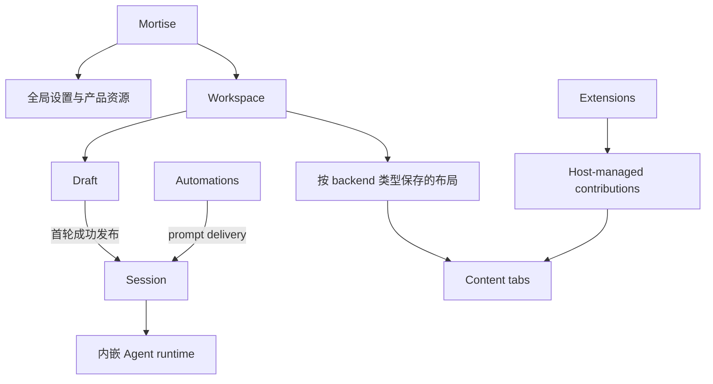
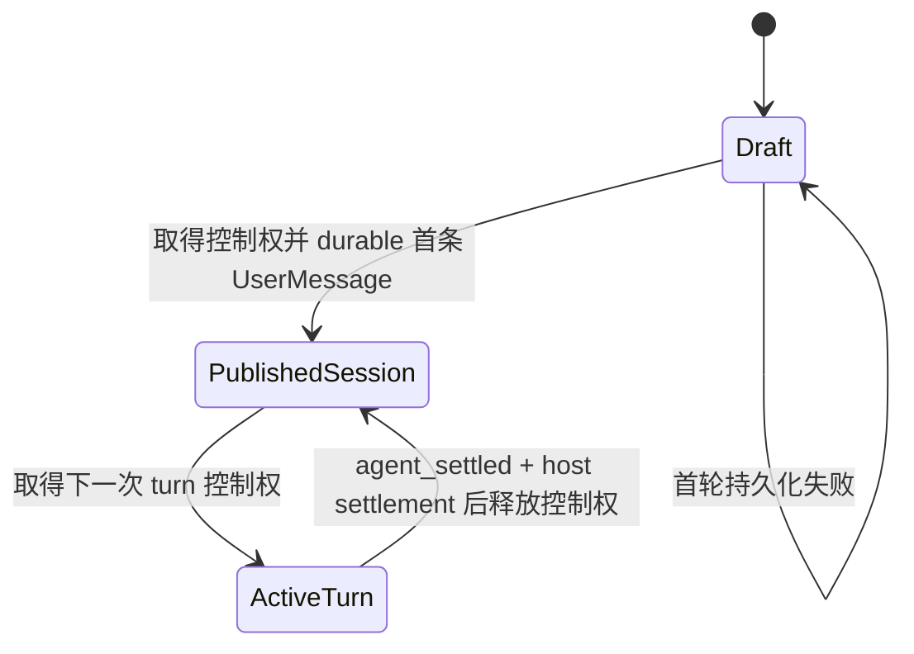

# Mortise 产品语义参考

状态：当前参考

更新日期：2026-08-02

## 用途

本文档集中记录 Mortise 目前已经可以确定的产品含义：核心概念是什么、它们如何关联、哪一层拥有解释权，以及哪些边界不应被实现偶然性改变。

它是产品与架构判断的参考，不是任务流程、开发检查表、API 手册或功能清单。使用它不需要为每次修改填写固定模板或报告。

本文档只把有明确依据的内容写入正文。文中明确标注为仍需决定的问题不是已接受语义，也不能用来推导实现。

## 参考边界

- 明确接受的产品决定和已接受的专题规范，是本文档的依据。
- 本文档说明产品含义；专题架构和协议文档说明对应领域的精确合同。两者应相互一致，而不是互相复制。
- 模块档案说明代码所有权、局部不变量和验证责任，不单独定义跨模块的产品含义。
- 现有代码、测试和历史行为是需要调查的上下文，不会因为已经存在就自动成为产品需求。
- 当本文档与已接受的专题规范真正矛盾时，这表明存在待解决的语义缺口；不应由旧代码默认选择其中一边。

## 产品定位与边界

Mortise 是一个由用户塑造、高度可扩展的桌面 Agent 平台。它优先通过用户配置和 Extension 扩展能力，而不是把所有工作流都固定在核心产品中。

- 产品名为 `Mortise`；无作用域的机器标识使用 `mortise`；项目自有包使用 `@mortise`。
- 本仓库只拥有 Mortise 产品和发布线。`pi/` 是 Mortise 自有的内嵌无头 Agent runtime 源码，不是本仓库中另一个独立产品、CLI 或发布线。
- 内嵌 Agent runtime 拥有 Agent Loop、Session 主会话记录、工具执行、compaction、retry 和 Extension runtime 等运行时语义。
- Mortise host 拥有 Workspace、客户端 UI、导航、通用布局、操作系统集成、Automations 编排和其他产品脚手架。
- Mortise 运行时和项目资源只使用 Mortise 自有的 `.mortise` 根。`.pi` 属于外部独立产品，不是 Mortise 的运行模式、fallback 或兼容数据源。

## 核心概念图

该图只表达产品概念关系，不表达代码依赖方向或存储结构。

## Workspace 与内容

### Workspace

Workspace 是 Mortise 的顶层用户上下文，也是规范内容和位置关系的长期归属边界。它不等同于文件夹，但始终有且只有一个主位置，并可以同时连接零个或多个附加位置；每个位置都指向一个本地或远程文件根。客户端页面布局以 Workspace 为作用域，但由各 backend 类型分别管理。

- Workspace 允许用户设置自己的显示名称。用户没有设置名称时，默认使用当前主位置根目录的最后一级文件夹名；这是派生的默认名称，不是 Workspace identity。切换主位置后，未自定义的名称随新的主文件夹更新，用户自定义名称则保持不变。
- Workspace 创建与编辑是有边界的短任务，使用同类模态界面承载名称与位置关系；侧栏编辑不跳转到通用设置页。
- Session、Files 工作台、Browser 实例、侧任务和 Extension 完整工具都带有 Workspace 归属；各 backend 类型保存的 Dock 布局也以 Workspace 分区。
- 主位置是 Agent 默认使用的工作位置，决定未明确指定位置时的命令行目录和相对路径起点。附加位置不会改变这个默认值。
- 本地主位置可以由用户主动选择。用户未选择时，Mortise 在默认 Workspace 目录下为它创建独立、持久的根目录；该目录不是临时目录或能力受限的 fallback，Agent 可以正常使用文件工具和命令行。远程主位置由对应的远程 Agent Server 提供。
- 附加位置不是只能查看的资料引用。在各自获得的权限范围内，Agent 可以像使用主位置一样读取、写入、搜索文件和运行命令；同一个 Workspace 可以同时包含本地与远程位置，并统一管理它们的访问权限。
- 每个位置都有稳定、可辨认的名称和明确的执行端点。搜索等操作可以覆盖多个已授权位置，但命令必须在目标位置所在的本机或远程端点执行；跨端点移动数据是明确的传输操作，不能伪装成同一文件系统内的普通路径操作。
- 每个已连接位置中都保存版本化的 Mortise Workspace 标记，其中包含稳定的 Workspace identity。创建 Workspace 或明确添加尚未标记的位置时，Mortise 写入该标记；之后重新连接时，只接受带有匹配标记的位置。
- 同一个 Workspace 标记可以同时存在于多个本地或远程位置中。标记只说明该位置已获准连接到这个 Workspace，不区分本体、复制品或唯一原件；哪个位置是主位置、哪些是附加位置，由 Workspace 当前的连接关系决定。
- “从应用移除 Workspace”只删除当前应用中的登记关系，保留所有位置、Workspace 标记和文件。之后重新添加带有相同 Workspace 标记的文件夹时，可以重新连接原 Workspace。
- “解除文件夹关联”只删除目标文件夹中的 Workspace 标记并断开该位置，保留普通文件且不影响同一 Workspace 的其他位置。Mortise 不提供“删除 Workspace 数据”这一工作区级命令；用户文件的删除仍属于普通文件操作。
- 用户可以新增附加位置，而不必为每个文件根另建 Workspace，也不必因此中断已有任务。解除、移除或替换位置前，Mortise 必须先中断仍可能继续使用该位置的 Session、子智能体、Automation run、工具或子进程，但不应无故中断与该位置无关的工作。
- 用户可以将带有匹配标记的位置切换为新的主位置。切换主位置时，Mortise 统一中断该 Workspace 中正在运行、排队、等待输入或等待恢复的 Session、子智能体和 Automation run，并停止仍可能写入旧主位置的工具或子进程；完成中断后再原子切换。
- 位置变更不会自动恢复被中断的任务。任务历史保留为 interrupted，之后可以由用户或 Agent 明确继续，并使用变更后的当前位置集合和主位置。未来尚未形成 run 的 Automation 调度定义不受影响。
- 一个已渲染布局不得混合不同 Workspace 的内容。
- 切换 Workspace 会替换整个活动布局，而不是只替换当前 Session 或左侧栏。
- 主侧栏以 Workspace 为中心，每个可展开 Workspace 下直接显示最近 Session；非 Workspace 导航保持在底部。
- 点击另一个 Workspace 下的 Session，语义上是切换 Workspace 并打开该 Session 的一次动作。

### Universal dock

每个 Workspace 按 backend 类型分别拥有一份可保存的 universal dock 布局基线，例如 Electron 和 WebUI 各自一份。布局不是不同 backend 之间实时同步的共享页面状态。

- Conversation、Files、Browser、侧任务和 Extension 完整工具都是平等的 content tab。
- 用户可以对 content tab 分组、拆分、移动和 detach；宿主拥有 tab 身份、标题、选择、关闭、焦点、权限和恢复语义。
- backend 启动时读取自己类型对应的最新布局文件，之后在内存中独立维护标签、分组、顺序和当前活动页。一个 backend 打开、关闭或移动内容，不会实时改变其他已经运行的 backend 页面，也不会自动让其他 backend 出现同一标签。
- 同一类型的多个 backend 可以写回同一份布局基线，产品语义采用最后一次完整写入覆盖。实现必须用独占写锁、临时文件和原子替换保证文件完整，不能产生半写或拼接后的布局。之后启动的同类型 backend 读取最新完整版本。
- 每个 Electron 应用身份只运行一个客户端实例；再次启动同一应用时聚焦已有实例。该限制不作为跨客户端或共享数据的全局锁。
- 在一个 Electron backend 中，同一 Workspace 只有一个主窗口，但可以拥有多个 detached 辅助窗口。辅助窗口仍属于该 backend 的同一 Workspace 布局，可以新增标签页和调整自身布局，但不能再次 detach 或形成嵌套窗口。
- 关闭 detached 辅助窗口只关闭该窗口投影，并把其中内容放回所属 backend 的主布局；它不关闭 Session、后台运行或规范内容。窗口位置、大小、显示器、焦点和拖拽中的临时几何只属于对应 Electron backend。
- WebUI 不提供 Mortise 管理的多窗口能力，并使用自己的 WebUI 布局文件。Electron 的 detached 窗口状态不会进入 WebUI 布局，WebUI 的页面操作也不会改写 Electron 的窗口投影。浏览器自身的窗口和标签页不属于 Mortise Workspace 布局。
- Electron、WebUI、不同版本的已安装客户端和源码开发客户端可以同时连接 Mortise。每个 Electron 应用身份各自遵守单实例规则，共享数据正确性仍由规范数据层的并发协议保证。
- `right` 只能是用户布局后的一个结果，不是产品 surface、Extension API 或专用右面板架构。应用 shell 不存在第二侧栏。
- 页面或 content surface 需要相邻导航时，使用该 surface 内部所有的 sidebar，不恢复全局右面板。
- 紧凑状态信息，例如 TODO、plan、后台任务或子会话摘要，默认使用轻量 popover 或悬浮状态，不自动成为持久 content tab。

### 内置内容差异

- Browser 新建 tab 是轻量空白页，不承载任务模板、Agent onboarding 或创建并发送 prompt 的操作。
- Browser 实例是 Workspace 的长期内容资源，不由某个 Session 拥有。同一 Workspace 中的 Session 可以创建、打开和控制 Browser 实例，并在自己的历史中记录使用关系；Session 关闭、归档或结束时不自动销毁 Browser。
- Session 的临时浏览需求复用同一种 Workspace Browser，不建立第二套 Session-scoped Browser 类型。临时实例可以在任务结束后由用户或发起它的任务关闭，但它在存在期间仍遵守 Workspace 的布局、权限和生命周期边界。
- Browser 实例的内容身份和生命周期归属于 Workspace，它在页面中的分组、顺序和窗口投影归各 backend 类型的布局。Mortise 浏览器档案属于应用全局；不同 Workspace 共享 Mortise 自有的登录状态、cookie、站点存储、history 和其他浏览器档案数据，不为每个 Workspace 建立隔离档案。
- 本地浏览器数据和 Chrome 浏览器扩展导入不属于当前已承诺能力。未来若提供浏览器扩展导入，只接受经过确定性兼容检查、确认其 manifest 和所用 API 均受当前 Electron Browser runtime 支持的扩展；不导入兼容性未知的扩展，不以 best-effort 加载或运行后碰运气作为支持方式，也不承诺 Chrome Web Store 或任意 Chrome/Edge 扩展兼容。
- Files 是 Workspace-scoped content workbench：选中文件在主区域显示，Workspace 文件树是该 tab 内部的 navigator，对不支持、过大或不安全的格式提供安全 fallback。
- 对有未保存编辑、正在运行或等待用户输入的 content，关闭或布局调整不应无提示丢失工作。

## Draft、Session 与 Agent 运行

### 主智能体、子智能体与模板

- 主智能体是当前 Session 中直接承接用户对话和主要任务的 Agent。它是 Session 的运行主体，不需要另外作为一个独立的、可单独管理的产品对象存在。
- 子智能体属于 Mortise 的核心能力，不再把它的长期产品边界理解为某个 Extension 私有能力。现有 Extension 形式的实现和设置文案属于历史实现，不能反过来决定产品归属。
- 子智能体首先是一项基础的临时委派能力：主智能体可以把一个边界清楚的临时任务交给一个子智能体执行，再接收它的结果。一次临时执行不等于创建了一个长期可管理的 Agent。
- 预制模板是建立在临时委派能力之上的更高层复用方式。模板不是正在运行的子智能体，而是针对某类任务预先准备的提示词、工具范围、权限或其他运行偏好；调用模板时，仍然是创建一次子智能体执行。
- 模板可以由 Mortise 内置、由用户创建，也可以由 Extension 提供。无论来源如何，模板都接入同一套核心子智能体能力；Extension 提供的是模板定义，不另行拥有一套子智能体执行系统。
- 当任务明确适合某个模板时，主智能体应优先使用该模板；没有合适模板时，仍可直接创建临时子智能体。模板数量可以逐步增加，但每个模板都应有清楚、互不混淆的用途和能力范围。
- 子任务与父 Session 的关系表示持久归属和可选的结果关联，不表示子任务属于父 Session 当前的 Agent Loop。智能体子任务拥有独立 Agent Loop；非智能体子任务使用自己的执行单元。父 Agent Loop 结束、重试或替换不影响已经创建的子任务。
- 关闭父 Session 的标签页或归档父 Session 只改变可见性，不停止父 Session 或子任务。删除父 Session 则先冻结新消息和新子任务，按已登记子任务各自合同停止并完成必要结算，再提交父子删除；失败时删除状态保持可见且可重试，不能留下父已删除而子任务仍运行的不可见状态。
- 平台只提供父子归属和必须执行的级联边界。结果是否保存、父 Session 如何查询、异常后是否恢复以及如何清理由具体子任务类型决定；平台不为所有任务统一建立结果待投递队列、自动唤醒或孤儿恢复机制。

### Draft 不是 Session

Draft 是 Workspace 级、尚未公开的编辑状态。它可以保存 composer 输入、附件和会话选项，但：

- 不进入 Session 列表；
- 不创建 Session 文件；
- 不拥有公开的 Session identity；
- 首条消息提交失败时保留，以便用户重试。

“新建会话”和普通启动默认进入 Workspace 级空 Draft，而不是提前创建空 Session。

### Publication

普通 New 在用户提交首条消息前仍然只是 Workspace 级 Draft。提交首条消息时，backend 必须先取得该 `sessionId` 的 turn 控制权，再把 Session identity 创建、首条 UserMessage 持久化和必要的 host metadata 处理组成一个不会暴露半成品的边界。代码中的 provisional runtime 只是实现阶段，不是独立的产品对象。

首条 UserMessage 成功追加、flush 并取得 durable acknowledgement 后，Session identity 即可被其他 backend 读取；它不需要等待首个 assistant message。随后产生的每条完整 AgentMessage 仍按自己的 tree entry 粒度独立持久化和共享。

首条 UserMessage 未能 durable 时，首轮请求不成立：backend 先核对会话文件尾部，确认失败后停止运行并丢弃未保存消息，不能留下可见的半成品 Session。用户输入可以保留在 Draft 或输入区供用户再次明确发送。`retryable` 只表示允许重新提交，不表示一个 Session 已经发布。Hidden/internal 与 branch 是显式例外。

Session 的公开可见性还必须遵守 Mortise metadata、UI overlay 和 projection 的正常持久化边界；这些 host 状态不能把尚未 durable 的规范 UserMessage 伪装成已接受。

### Session 与消息

Session 是已跨过 publication boundary 的可恢复对话实体。内嵌 Agent runtime 拥有规范对话 message entry；Mortise 可以维护 UI overlay、排队状态和产品 metadata，但 overlay 不是规范 message。

对消息和运行来说，以下状态不是同一件事：

- **Accepted**：对应运行时或持久队列已接受消息/投递意图。
- **Durable**：规范 message 或队列条目已持久化。
- **Published**：首条 UserMessage 已 durable，Session identity 已成为可读取的规范实体；不以首个 assistant message 为门槛。
- **Runtime settled**：内嵌 Agent runtime 已发出 `agent_settled`，当前 Agent Loop 不再推进。
- **Host settled**：在 runtime settled 之后，Mortise 必要的 metadata、projection、工具副作用旁路记录和输入处置也已持久化；只有此时才能报告 turn 完成并释放控制权。

客户端、RPC 和 Automation 不应将这些边界压缩成一个模糊的“成功”。

每条完整 AgentMessage 都对应一个独立的规范 tree entry。它必须完成 append、flush 并取得 durable acknowledgement 后，才对其他 backend 共享；不等待整个 turn、`agent_end` 或 `agent_settled`。未完成的流式 assistant 内容只存在 owner backend，不能进入共享 transcript。写入失败时，backend 必须先核对文件尾部；确认失败后停止当前运行、丢弃未保存内容，并使用会话内请求错误样式警告用户。

### Turn、attempt 与 logical run

- **Turn** 是一次 assistant response cycle，包括它的 tool call 和 tool result。`turn_end` 只结束当前 turn。
- **Attempt** 是一次底层 Agent execution，通常从 `agent_start` 到 `agent_end`。它用于区分重试、恢复和诊断中的不同执行段，不是普通用户需要理解或操作的产品实体。
- **Logical run** 是从一次 prompt 被接受开始，经过运行时继续处理，直到内嵌 Agent runtime 发出 `agent_settled` 的连续运行。Mortise 在此之后仍要完成 host settlement，才能向客户端投影最终完成。

一个 logical run 可以包含多个 turn、provider auto-retry、compaction continuation 和运行时接受的后续投递。`agent_end` 只是底层 attempt 边界，不是 Mortise 的最终完成信号。

- **Steer** 表达“改变当前 turn 方向”的意图。native steer 被接受时，它留在当前 turn 内并继续使用当前控制权；native steer 不可用、拒绝或未及时接受时，降级为下一次 turn 的待发送消息，并明确显示已经降级。
- **Follow-up** 不延长当前 turn。它先留在发送方 backend 的待发送区；当前 turn 完成并释放控制权后，下一次 turn 必须重新竞争。竞争失败时不标记 accepted、不进入共享 transcript、不自动重试、不转发、不创建 branch，原内容留在待发送区，之后只能由用户或 Agent 再次明确发送。
- **Retry** 表达在不改变用户意图的前提下恢复未完成运行。Provider auto-retry 是当前 logical run 的内部恢复，中间 `agent_end` 不得被 UI 投影为最终完成。
- **Stop/abort** 终止当前运行，并在必要 settlement 完成后投影为 interrupted。晚到事件不能越过该边界将运行改回 completed。

用户主动 Stop 只终止当前 turn。backend 完成有限收尾后释放控制权；未完成的流式内容丢弃，已经 durable 的消息保留，未被 Agent 消费的待发送内容保留其 identity、附件和 metadata。Stop 后待发送消息不会自动回放，新的明确发送或继续动作才能重新投递它们。同一个 turn 可以有多条 follow-up，按顺序保留且保持独立 identity；待发送区有明确上限，超过上限的新输入必须拒绝但不能丢弃原内容。

UI 将 follow-up 待发送区固定放在 composer 正上方，而不是把尚未投递的内容显示成正式 transcript 中的用户气泡。每条消息使用一行紧凑预览，长内容可以省略显示，但完整内容、附件和其他 metadata 仍由发送方 backend 保留；竞争失败显示为未接受/待发送，不得静默丢弃或自动重试。消息真正进入 Agent context 并完成 canonical durability 后，才离开待发送区并成为 transcript 中的用户消息。

每条待发送消息右侧只提供三个直接操作：使用 Lucide `ArrowUp` 的发送、编辑和删除。三个按钮均使用图标并提供 tooltip；不增加复制、更多菜单或其他常驻操作。发送表示明确重新投递该消息，编辑修改的是这条待发送记录，删除只移除尚未投递的记录。客户端不能静默丢弃消息，也不能只把纯文本复制回 composer 来代替完整队列状态。

### Session 控制权

Electron backend 与 WebUI backend 独立管理各自的 Agent Loop；Agent Loop 是 backend 的临时子进程，不是控制权持有者。每台机器按需运行一个全局的本地内存协调器，以 `sessionId` 作为控制键，不按 Workspace 或文件夹分区，也不持久化控制记录。协调器只负责授权和关系登记，不执行模型、工具或 Session 文件写入。backend 取得 turn-scoped control handle 后，才能接受该 Session 的输入、启动 Agent Loop、执行工具和写入规范 transcript；Agent Loop 不能直接取得协调器控制权或操作系统锁。

控制权按 turn 持有，而不是按整个 Session 或无限延伸的 logical run 持有。一个 turn 只有在 Agent runtime 发出 `agent_settled`，且 backend 完成消息持久化、工具副作用旁路记录和 host settlement 后才结束，之后释放控制权。多个 backend 竞争同一 Session 时，失败方直接收到明确冲突，不排队、不自动重试、不转发、不接管、不创建 branch。当前语义只保证同机协调，不支持跨机器同时写同一 Session。

可能产生外部副作用的工具使用独立、版本化的旁路记录，至少包含稳定的 `toolCallId`、`attemptId`、`started`、`completed` 或 `outcome-unknown`，不混入 Session transcript。持久化失败、传输失败和只读工具失败可以由 backend 本地自动重试；`outcome-unknown` 作为结构化工具结果交给模型决定核验、重试、换方案或停止。用户界面不提供通用的直接工具重试按钮；模型明确选择重试时，宿主只执行正常的工具格式、权限和运行状态检查。

控制句柄按 turn 失效。释放后旧 backend 的晚到消息、工具结果和运行事件不得写入 transcript、改变 Session 状态或影响新 backend，最多记录诊断。协调器不可达不撤销已有 backend 持有的控制权，也不打断其正常运行；新控制请求必须等待协调器重启并从存活 backend 和操作系统锁重建关系后重新提交，恢复期间不接受、不排队，也不能绕过协调器。backend 关闭采用有上限的正常收尾：停止新输入和新工具，完成可确认的消息与工具收尾，处理结果未知的工具，再释放控制句柄；超过时限的运行被终止。最后一个 backend 关闭后不再保留 Agent Loop 或 Automation 执行进程。

### 中断与恢复

恢复未完成的运行时，Mortise 不向正式 transcript 追加一条伪造的“继续”用户消息。恢复也不承诺外部模型能够保留中断请求的内部状态或从某个 token 精确续写；它从 Session tree 当前分支中最后一个已经持久化且一致的输入位置重新开始 execution。Tree 的 `parentId` 路径是恢复位置的规范来源，不另建一套平行的恢复历史。

最后一条中断 assistant 回复中已经完整产生的可见内容应继续属于同一条用户可见回复，并在模型能力允许时作为续写参考。完整的历史消息、已经完成的 tool call 和 tool result 继续保留；不完整的 thinking、tool call、provider signature 和其他协议片段不能作为可靠上下文。当前 Provider 无法可靠续写时，可以退回最后一个完整输入重新生成，但不能伪装成精确续写。

一次恢复可以产生新的 attempt，但不因此创建新的用户任务或新的 assistant 对话消息。UI 按以下方式表达：

- 尚未出现可见 assistant 内容时，自动重试只显示临时运行状态，不增加隔断。
- 已出现部分内容或经历应用断开后恢复时，在同一条 assistant 回复内保留一个轻量的“已从中断处恢复”边界，然后继续显示内容；不新开消息，也不完全无痕拼接。
- 连接或运行错误属于该回复的执行状态，不是 assistant 正文。恢复成功后错误状态收束为轻量恢复标记；最终无法恢复时才保留“已中断”状态和继续入口。
- Attempt 细节可以出现在诊断或展开信息中，但普通对话只呈现同一个 logical run 和同一条 assistant 回复。

## Extension 语义

Extension 是 Mortise 可扩展性的一级提供者；Mortise 尽量保持通用宿主、生命周期和渲染边界，而不把特定 Extension 业务写进核心。

- 产品中只有 Mortise Extension，不再存在 `pi`、`mortise` 两种 Extension target。Extension manifest 不需要用 target 表达宿主身份，Mortise 也不应继续解析、筛选或兼容两套 target；迁移完成后删除相关 target、engine、catalog 字段和分支，不保留别名或 fallback。
- Extension 统一运行在 Mortise 的内嵌 headless Agent runtime 中。它可以注册工具、命令、Provider、生命周期处理或其他后台能力，也可以选择向 Mortise GUI 发布 contribution；GUI 是可选能力，不是另一种运行模式，也不是每个 Extension 的必需条件。
- Extension 的安装和基础可用范围属于应用全局。默认情况下，已安装的 Extension 能力对所有 Workspace 可用；Workspace 不单独保存一套 Extension 开启和关闭状态。
- 全局 Extension 目录和 `<workspace>/.mortise/extensions` 都是正式来源。打开或附加 Workspace 时，backend 立即发现并加载这些来源中的 Extension；约定目录内的 Extension 默认信任并允许执行，不设置逐 Workspace 或逐 Extension 授权，也不扫描工作区其他位置的任意脚本。
- 未来引入“模式”后，由模式配置在该模式下启用或关闭哪些 Extension 能力。这是模式对全局能力集的选择，不是 Workspace 自己拥有另一套 Extension 管理。
- Extension backend 是来自正式来源的受信任本地代码，以用户系统权限在子进程中运行；这是长期信任模型，不是等待未来权限沙箱替代的过渡状态。安装界面可以显示来源并说明其本地代码权限，但不能用并不具备强制隔离能力的权限开关制造安全错觉。
- 每个 backend 独立加载和管理自己的 Extension runtime。运行中的 Extension 文件变化不立即热重载；当前实例继续运行，修改在下一次 backend 或 Workspace 重新加载时生效。单个 Extension 加载或运行失败只禁用并警告该 Extension，不得拖垮其他 Extension、Session 或 backend；同一次加载中不反复自动重试。
- Extension GUI 仍只能通过 Mortise 的版本化 contribution API 进入产品界面，但这个 UI 边界不会同时将 backend 变成 sandboxed code，也不限制 backend 直接使用当前用户拥有的文件、网络和进程能力。
- Extension GUI 是 Extension runtime 发布的版本化、可序列化 contribution，不是 Extension 代码进入 Mortise renderer。
- Mortise 信任 host/RPC 注入的 Workspace、Session、runtime 和 Extension identity，不信任 contribution 内容自报身份。
- Host-rendered UI 是默认边界。需要自由应用 UI 时使用宿主分配区域内的隔离 sandbox；sandbox 不获得父 DOM、凭据、Electron IPC、任意网络或文件系统权限。
- Extension 声明内容归属、placement intent 和优先级；Mortise 决定共享区域的实际位置、容量、顺序、overflow、focus、冲突和响应式退化。
- 对话相关 UI 默认归属产生它的 message、tool 或 turn；影响下一条消息的 UI 归属 composer；需要脱离对话长期操作的完整工具使用 `workspace.content`。
- `workspace.content` 只使工具可被用户打开，不自动打开或抢占焦点。Extension 的初始放置偏好不得覆盖用户之后的移动、分组、detach 和保存布局。
- Extension runtime、贡献注册、命令处理器和内存状态归加载它的 backend，随 backend 结束，不跨 backend 共享。关闭 Extension 标签页只移除当前 backend 的前端投影，不卸载 Extension、不停止其后台能力，也不删除持久状态。
- Mortise 可以为 Extension 提供按 Workspace、backend 类型和 Extension identity 隔离的可选文件存储；Electron 与 WebUI 默认不共享。Extension 是否保存状态、保存什么、如何恢复、迁移和清理由具体 Extension 合同决定；只有 Extension 明确写入 Session 或 Workspace 公共文件的数据才跨 backend 可见。
- backend 重启时重新加载 Extension，再按本类型布局创建新的投影。布局引用的 Extension 不存在或加载失败时保留不可用占位项；Extension 恢复后可以重新绑定。移除或卸载 Extension 不自动删除平台托管状态，只有用户明确清除扩展数据时才删除。

replace 类高自由 surface 的长期边界仍需要产品决定。

## Skills 与管理界面

Skills 是 Agent 可自动发现并按需读取的用户资源。全局 Skills 是主要的日常管理范围；当前 Workspace 也可以提供项目级 Skills，用于表达该项目自己的知识和约束。

- 全局 Skills 与当前 Workspace Skills 都由运行时自动发现，用户不需要在每次对话中手动挂载。
- 未选择 Workspace 时仍可查看、新建和编辑全局 Skills；技能管理不能依赖一个虚构或默认 Workspace。
- 有活动 Workspace 时，有效技能集合由全局与项目资源合并而成。同一 `slug` 冲突时，Workspace Skill 覆盖全局 Skill；这表示项目规则的局部优先级，不会修改或删除全局文件。
- 新建 Skill 默认使用全局范围，用户可以明确选择当前 Workspace 范围。编辑已有 Skill 时保持其来源范围，不静默迁移。
- Skill 的长期新建和编辑使用应用外壳中的固定管理页面或详情区。Automations、Settings 等同类高频管理也遵守这一界面含义；弹窗只用于短暂选择、确认、凭据或必须阻断当前操作的任务。
- 前端与运行时通过版本化领域合同、稳定语义动作和可观察状态解耦。自动化测试可以批量复用同一个宿主，但不得把 DOM 结构或视觉坐标当成产品合同。

## Automations 语义

Mortise Automations 是唯一的自动化产品能力。它统一定义规范存储、事件入口、occurrence claim、run 记录和管理界面；具体 retry、结果记录和外部副作用恢复由 Automation 定义及其工具合同负责。

- Extension、CLI、Agent tool、Electron 和 WebUI 使用同一 Automation domain model 和规范存储，不能各自创建不同的 Automation 产品、定义格式或 run history。Electron backend 与 WebUI backend 各自管理自己的 scheduler 和执行单元，不存在所有客户端关闭后仍常驻的共享 Automation 运行服务。
- 外部程序是 event producer，不是另一套自动化产品；外发 webhook 是 action，不是 event ingress。
- 当前 trigger 类型是时间和事件。时间 trigger 包含 `cron`、`once` 和 `interval`；action 是 prompt 或 outbound webhook。
- Automation 的 Agent 动作始终使用 Session 语义。默认目标是创建一个新 Session；用户也可以明确选择已有或事件 Session，并使用 `followUp` 或 `steer` 投递。
- Mortise 不提供脱离 Session 存在的 Isolated Agent 作为 Automation target，也不为后台 Agent 执行建立另一套用户可见的记录、继续或提升语义。
- Automation run history 记录它创建或投递到的 Session 及动作结果，完整对话和后续交互仍属于该 Session，不在 run history 中复制第二份对话。
- Automation 不重新解释 Agent Loop。`followUp`、`steer`、interrupt、retry、queue 和 turn ordering 继承内嵌 Agent runtime 语义。
- 事件或时间 occurrence 必须先持久化，再进行匹配、claim 和执行。Adapter 不能绕过定义匹配、run claim 和历史直接向 Session 注入 prompt。
- 多个活动 backend 同时观察到同一 occurrence 时，必须以规范存储中的稳定 occurrence identity 和原子 claim 保证最多一个 backend 执行。所有 backend 都关闭期间错过的 trigger 直接跳过，之后启动 backend 时不补跑。
- Action 成功的含义取决于目标：新 Session 要跨过 publication；existing Session 必须按 Session 的 follow-up 重新竞争或 steer accepted 语义处理；webhook 的成功边界由该 action 合同定义。
- Automation 只使用 Mortise 规范存储，不读取 `.pi`、旧 `automations.json` 或 Extension registry 作为运行时数据源。
- Agent 和 Extension 可以通过同一 host-owned capability 自由创建、修改、删除和启停 Automation，不要为这些变更增加额外的用户确认步骤。操作仍必须经过规范 schema、Workspace identity、operation identity 和并发修订检查，并在 Automation 管理界面中可见。
- 所有 Automation 定义都可以导出和导入，不因 trigger、condition、action 或外部依赖的种类拒绝导出，也不在导出时静默删除不可移植部分。导出物保留完整定义和依赖声明，但不包含秘密值、运行历史、已接收事件、排队或运行中任务、执行锁和数据库查询索引。
- 导入时自动连接当前 Workspace 中能确定找到的依赖。依赖完整的 Automation 可以保留原启用状态；缺少 Session、Extension、秘密、事件源或其他必需依赖时，仍导入完整定义，但标记为配置不完整并保持关闭，直到用户补齐或重新选择依赖。
- 批量导入是 Automation 可移植能力的必需部分。用户可以在一次操作中选择多个定义文件或一个包含多条定义的 bundle；Mortise 统一校验并给出逐条结果，单条冲突、缺失依赖或失败不阻止其他有效条目导入，也不要求用户为每条重复一套导入流程。

Automation 的导出和导入是明确的用户操作，不等于直接复制或同步运行时 SQLite 数据库，也不自动承诺版本控制或实时同步。

## 设置与模型选择

- AI connection、model 和 thinking defaults 是全局设置，集中显示在一个 `Default` 区域。
- 这些 default 没有 Workspace 级 override；Session 仍可以按需选择它自己的连接、模型和 thinking level。
- 语义 model reference 可以表示“跟随当前 Session”或“跟随某个全局 default slot”，而不需要把当前 model ID 复制成新配置。
- 从 provider 获取远程模型只刷新候选列表；只有用户明确选择某个模型后，才将该单个模型加入配置。

## 客户端与平台能力

Electron 和 WebUI 是同一 Mortise 产品的不同平台投影，但不以功能完全对等为目标。

- 它们在实际支持的能力上共享 domain model、state boundary 和可复用 UI。
- Electron 是完整桌面表面，负责原生窗口、操作系统集成、本地资源、BrowserView 和其他 privileged capability。
- WebUI 是有意简化的子集。它可以隐藏不支持的能力，或通过 typed capability 明确降级；不得用假实现伪装支持原生窗口、detach、系统对话框或 Electron Browser content。
- 文件读写、搜索、终端命令和进程始终由管理目标 Workspace 位置的 backend 执行。目标位置离线、被移除或不可访问时明确失败，不自动切换到同一 Workspace 的另一个位置。
- 文件选择框、原生菜单、系统通知和桌面窗口等客户端原生能力由发起请求的客户端执行。当前客户端不支持时明确返回不支持，不因本机存在其他客户端而静默转交。没有明确前台发起客户端的 Automation 或子任务不能使用交互式客户端能力，也不等待、广播或任意选择一个 Electron。
- 相同 viewport 和交互只在能力合同明确要求一致时才要求跨平台对等。

## 数据、兼容与权威边界

- Mortise 对当前支持的自有数据使用一个规范 authority，不通过无期 fallback、alias、dual-write 或并行 runtime 维持已被替换的架构。
- 规范数据共享不表示 backend 运行状态共享。每个 backend 独立管理自己的 Agent Loop、Extension runtime、Automation scheduler、客户端投影和内存状态；它们只通过明确的规范文件或存储合同共享 Session、Workspace、配置、Automation 定义和其他持久数据。
- 历史数据导入只能是显式、离线的迁移操作，不是启动时的运行时读取路径。
- 不同版本的已安装和源码开发 backend 可以共享同一 Mortise config/data directory 并存运行。共享数据层使用原子事务、幂等 operation identity、乐观并发、版本化 schema 和 capability negotiation 作为安全边界。
- 对规范共享数据，不兼容的写能力只限制为 read-only，而不是依赖全局 backend lock 或为每个 backend 创建不同的可变副本。按 backend 类型保存的布局和 Extension 可选状态是明确归属的客户端投影，不是规范共享数据的复制品。

## 已接受的详细参考

- [The Red Line: bottom layer vs scaffolding](architecture/red-line.md)
- [Mortise Automations Architecture And Protocol](architecture/automations-protocol.md)
- [Pi Extension GUI Architecture](architecture/pi-extension-gui.md)
- [Mortise Extension Authoring Guide](../apps/electron/resources/docs/pi-extensions.md)
